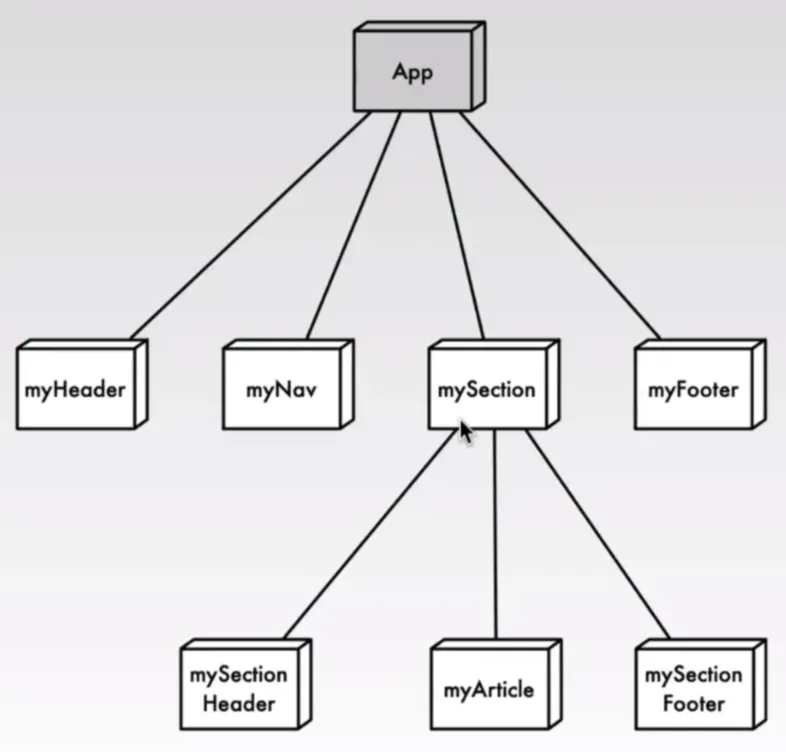
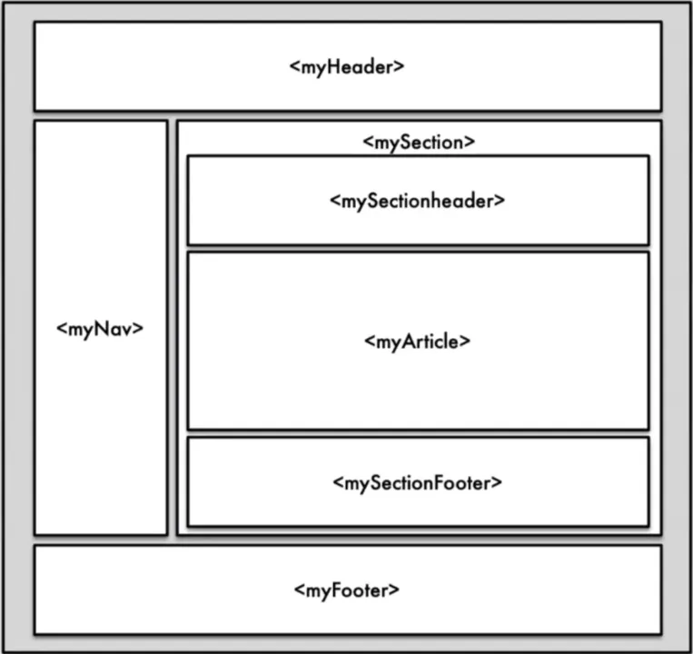

# 1 Frameworks für Reaktive Anwendungen

- _**Reaktive Anwendungen**_ sind Webanwendungen, die Declarative Rendering anwenden und folgende Merkmale aufweisen
    - Erkennung von Zustandsänderungen der Anwendung
    - Verbreitung von Zustandsänderungen an abhängige Daten
    - Rendering der Änderungen im View
    - Unmittelbare Rückkopplung von Nutzerinteraktionen 
- Umsetzung durch Model-View-ViewModel-Pattern, asynchrone Programmierung, Data Binding und Aspekte funktionaler Programmierung


- Vue.js von Evan You, seit 2014
- Angular von Google, seit 2009
- React von Facebook, seit 2013

# 2 Deklaratives Rendering


MVVM是Model-View-ViewModel的缩写，它是一种基于前端开发的架构模式，其核心是提供对View和ViewModel的双向数据绑定。
Vue提供了MVVM风格的双向数据绑定，核心是MVVM中的VM，也就是 ViewModel，ViewModel负责连接View和Model，保证视图和数据的一致性。
model 变化了 可以通过 VM 自动去更新 view ,   view 变化了 也可以自动印象 Model 
VUE 完全不用 DOM 的语法, 但是本质还是使用 DOM  


- View
    - Einbettung von Direktiven in HTML als Grundlage für das Data-Binding
- Data Binding (Binder)
    - Verknüpfung von View und View-Model
- View-Model
    - Modellierung von Eigenschaften, welche Daten repräsentieren
- Model
    - Hilfsdatenstrukturen und persistente Speicherung


- **_Deklaratives Rendering_** definiert Abhängigkeiten zwischen den Elementen und Attributen des DOM und den Daten der Geschäftslogik
- **_Zwei-Wege-Data-Binding_**: Nutzereingaben im View werden automatisch auf die Datenstruktur der Geschäftslogik abgebildet und Änderungen an diesen Daten automatisch in den View übernommen 
- Beispiele: Vue.js, Angular.js und React
- Vorteil: keine explizite und aufwändige Programmierung der DOM-Manipulation, sondern Fokus auf Beschreibung der Abhängigkeiten zwischen DOM und Geschäftslogik


# 3 Vue.js

Vue.js ist ein progressives JavaScript-Framework, das speziell für die Entwicklung von interaktiven Benutzeroberflächen und Single-Page-Anwendungen (SPAS) entwickelt wurde.
Eigenschaften von Vue.js:
- Reaktivität: Vue nutzt ein reaktives Datenbindungssystem, das automatisch Änderungen im Datenmodell erkennt und diese in der Benutzeroberfläche anzeigt.
- Komponentenbasiert: Anwendungen in Vue werden in wiederverwendbare und isolierte Komponenten unterteilt, die HTML, CSS und JavaScript in einer logischen Einheit vereinen.
- Progressives Design: Es lässt Sich schrittweise in bestehende Projekte integrieren, sodass man kleine Teile einer Webseite mit Vue verbessern kann, ohne die gesamte Anwendung umzustellen.
- Einfachheit: Vue hat eine niedrige Einstiegshürde. Die Syntax ist klar und leicht nachvollziehbar.
- Virtueller DOM: Vue verwendet ein virtuelles DOM, das effizientere Updates an der Benutzeroberfläche ermöglicht, indem es Änderungen vor der tatsächlichen Darstellung optimiert.
- Community: Vue.js hat zweifellos eine sehr aktive, unterstützende und einladende Community, was sie für viele Entwickler attraktiv macht. Die Community legt großen Wert darauf, Anfängem zu helfen. Es gibt viele Tutorials, Dokumentationen und Hilfestellungen. Vue ist ein Open-Source-Projekt, und die Community ist stark um die aktive Mitarbeit und Offenheit für neue Ideen herum aufgebaut.


**Was ist ein Framework?**
Ein **Framework** ist ein vorgefertigtes Software-Gerüst, das Entwicklern wiederverwendbare Werkzeuge (Komponenten, Regeln) zur Verfügung stellt, um Anwendungen effizient zu entwickeln. Es bietet eine strukturierte Architektur, automatisiert viele Standardaufgaben und legt fest, wie verschiedene Teile einer Anwendung miteinander interagieren. Man fügt die Logik in die vorgegebenen Strukturen ein, während das Framework die Kontrolle über den Ablauf übernimmt.    
Die beliebtesten Frameworks für Frontend in JavaScript sind: **React** (Meta), **Angular** (Google), **Vue.js** (Evan You/Community), Svelte, Next.js, Ember.js (LinkedIn, Microsoft), Lit (Google), Preact oder Alpine.js.


# 4 Eigenschaften von Vue.js

- Reaktivität: Vue nutzt ein reaktives Datenbindungssystem, das automatisch Änderungen im Datenmodell erkennt und diese in der Benutzeroberfläche anzeigt.
- Komponentenbasiert: Anwendungen in Vue werden in wiederverwendbare und isolierte Komponenten unterteilt, die HTML, CSS und JavaScript in einer logischen Einheit vereinen.
- Progressives Design: Es lässt Sich schrittweise in bestehende Projekte integrieren, sodass man kleine Teile einer Webseite mit Vue verbessern kann, ohne die gesamte Anwendung umzustellen.
- Einfachheit: Vue hat eine niedrige Einstiegshürde. Die Syntax ist klar und leicht nachvollziehbar.
- Virtueller DOM: Vue verwendet ein virtuelles DOM, das effizientere Updates an der Benutzeroberfläche ermöglicht, indem es Änderungen vor der tatsächlichen Darstellung optimiert.
- Community: Vue.js hat zweifellos eine sehr aktive, unterstützende und einladende Community, was sie für viele Entwickler attraktiv macht Die Community legt großen Wert darauf, Anfängern zu helfen. Es gibt viele Tutorials, Dokumentationen und Hilfestellungen. Vue ist ein Open- Source-Projekt, und die Community ist stark um die aktive Mitarbeit und Offenheit für neue Ideen herum aufgebaut.


# 5 Komponenten

- _**Komponenten**_ sind einzelne unabhängige Elemente, die einen eigenen Zustand, Markup und Stil haben
- Komponenten zielen darauf ab, Webanwendungen zu schreiben, die bezüglich Wartbarkeit, Übersichtlichkeit und Wiederverwendbarkeit strukturiert sind
- Vue-Komponenten sind wiederverwendbare, unabhängige Bausteine einer Vue-Anwendung, die HTML, CSS und JavaScript bündeln. Komponenten können innerhalb anderer Komponenten eingebettet werden, wodurch eine hierarchische Struktur entsteht. Jede Komponente hat ihren eigenen Zustand und Methoden, die nur innerhalb dieser Komponente wirken. Komponenten machen den Code modular und erleichtern Wartung und Skalierung.

每个组件中包含 
- template
- script
- style 

Vorteil
- Wiederverwendbarkeit: einmal erstellen, mehrfach nutzen
- Modularität: isolierter Code reduziert Fehler
- Wartbarkeit: klare Struktur und Lesbarkeit





App.vue
```vue
<script setup>
	import Header from './components/Header.vue';
	import Card from './components/Card.vue';
</script>

<template>
	<Header />
	<Card />
</template>
```


Header.vue
```
<template>
	<h1>Hello!</h1>
</template>
```


Card.vue
```
<template>
	<!-- Bootstrap Card -->
</template>
```

# 6 Single File Components

- Programmierung von Vue-Anwendungen in JS-Dateien oder innerhalb des `**<script>**`-Elements ist prinzipiell möglich, aber kompliziert und unübersichtlich für größere Anwendungen
- **_Single File Components_** (**_SFCs_**) kapseln HTML-Template, Vue-JS-Code und CSS einer Komponente in einer einzigen Datei
- Dateierweiterung: `**.vue**`
- Problem: SFCs können nicht durch den Browser gerendered bzw. ausgeführt werden, sondern müssen vor dem Deployment in HTML- und Java-Script-Dateien übersetzt werden
- Kompilierung und Hinzufügen von Bibliotheken (z.B. Bootstrap) während eines Build-Prozesses
- Empfehlung: Verwendung von Entwicklungsumgebungen wie Vite

# 7 Grundstruktur einer .vue Datei

Anwendung wird in eine hierarchische Struktur von Komponenten aufgeteilt, aus denen sie sich zusammensetzt


```vue
<script setup>
	// JavaScript Logik
</script>

<template>
  <!-- HTML-Struktur -->
</template>

<style scoped>
	/* CSS */
</style>
```

1. `<script setup>`
    1. Hier Wird die Logik der Komponente implementiert, wie Daten, Funktionen und Reaktivität.
    2. Alles, was im script setup definiert wird, ist automatisch in der Sektion verfügbar.
2. `<template>` 
    1. Enthält den HTML-ähnlichen Code, der das Layout und die Struktur der Komponente definiert.
    2. Man kann direkt auf Variablen, Methoden und reaktive Daten aus dem Block zugreifen.
3. `<style scoped>`
    1. Das scoped Attribut sorgt dafür, dass die definierten CSS-Regeln nur auf die aktuelle Komponente angewendet werden und nicht global sind.  (就是在目前这个 .vue 中有效 )
    2. Ohne scoped: Die CSS-Regeln gelten global für alle Komponenten, was Konflikte verursachen kann. (就是在整个 projekt 中所有的 vue 都有效)


# 8 快速入门 

可以看到 不需要手动 获取标签给他加数据了, 而是 自动的 数据自动渲染到 view 上了 


