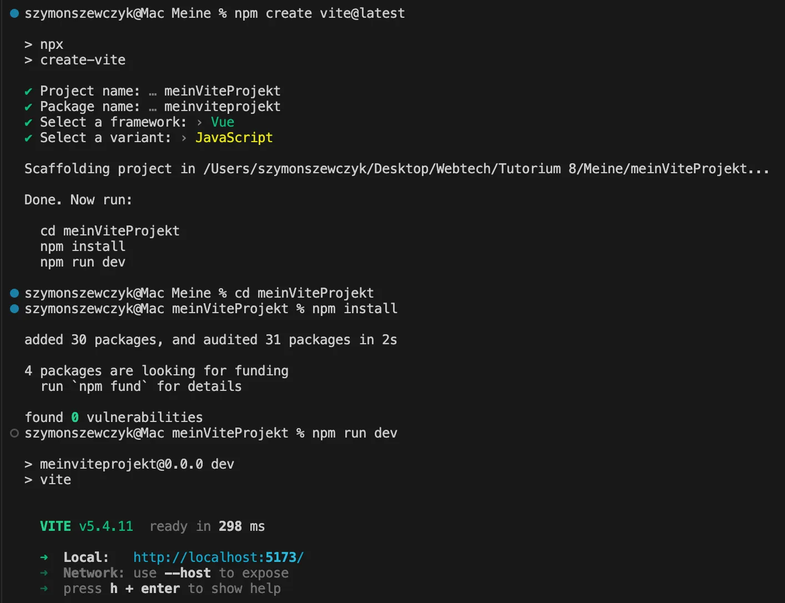

# 1 步骤

## 1.1 创建 vue project 以及 运行这个项目

1
`npm create vue@latest`  oder `npm create vite@latest`




2
cd projektName

然后 安装依赖包：进入自定义的项目下，运行命令
`npm install`

会按照 package.json 中的定义的包去安装 
然后 出现文件夹1node_modules 


3
执行npm run dev  启动项目啦

```
🦄  npm run dev

> vue-project@0.0.0 dev
> vite


  VITE v6.0.3  ready in 531 ms

  ➜  Local:   http://localhost:5173/
  ➜  Network: use --host to expose
  ➜  Vue DevTools: Open http://localhost:5173/__devtools__/ as a separate window
  ➜  Vue DevTools: Press Alt(⌥)+Shift(⇧)+D in App to toggle the Vue DevTools
```

用 http://localhost:5173/ 去访问项目


## 1.2 往这个 project 中添加一个新的 npm package 

在这个 vue project 的目录下

`npm install --save is-odd`

然后 在 package-lock.json 和 package.json 中  可以看到  is-odd 已经被添加进入了 


使用 isOdd
https://www.npmjs.com/package/is-odd

往 App.vue 中加入 下面的代码 
这样在载入 这个 vue project 界面的时候  console 就会显示 一些 信息了 

```
const isOdd = require('is-odd');
 
console.log(isOdd('1')); //=> true
console.log(isOdd('3')); //=> true
 
console.log(isOdd(0)); //=> false
console.log(isOdd(2)); //=> false
```


# 2 Wichtige Kommandos

npm init: erstellt eine neue package.json Datei.
npm install paketName: installiert ein Paket
npm update: aktualisiert installierte Pakete
npm uninstall paketName: entfernt ein Paket
npm run scriptName: führt benutzerdefinierte Skripte aus, die in package.json definiert sind


# 3 问题 

## 3.1 Node.js : EBADF, Bad file descriptor

https://stackoverflow.com/questions/76841935/installing-an-npm-package-but-this-error-comes-up

执行 `npm install`
出现报错 
```
npm warn tar TAR_ENTRY_ERROR UNKNOWN: unknown error, write
npm error code EBADF
npm error syscall write
npm error errno -4083
npm error EBADF: bad file descriptor, write
```


问题原因 

```
Got the solution.

I was doing that work on my google drive, and that is the only thing done differently.

The installing of external node modules worked for me when I installed them in a directory which is directly in the hard drive or SSD of your PC. I am not sure about pendrives and external hard drives.

so yeah, just change the location of your document/file/folder to your local hard drive and the error won't come.

```


## 3.2 Can't open the dev servers seite with firefox.

现象
And I started th server. It now says I can open a website on http://localhost:5174/

But if I cklick on the link, firefox, my default browser is not able to load the website. The first get request fails already with NS_CONNECTION_REFUSED. Why?

---


解决方式 
https://github.com/vitejs/vite/discussions/14754

1
It seems like Chrome would use a fallback to IPv6 address automatically, which Firefox does not.
Finally, navigating to http://[::1]:5173/ in Firefox seems to work just fine.

`http://[::1]:5173/` refers to a **local development server** address that uses the **IPv6 loopback address** and runs on **port 5173**. Let me break this down for you:

**`[::1]`**

- This is the **IPv6 loopback address**, equivalent to `127.0.0.1` in IPv4.
- It refers to the **local machine** (localhost).
- The square brackets `[]` are required for IPv6 addresses in URLs.


2
You saved me the biggest headache in trying to figure this out. Just started using vite and after creating a new project, `npm run dev` was opening Firefox and saying unable to connect. I had a Firefox `about:config` setting, `network.dns.disableIPv6` set to True. That setting was adjusted because of my VPN, but it appears that it needs to be turned off for vite.

3
I was able to solve this inconvenience by simply specifying 127.0.0.1 in the configuration.
```
devServer: {
    open: true,
    https: {
        key: "/path/to/server.key",
        pfx: "/path/to/server.pfx",
    },
    host: '127.0.0.1',
}
```
