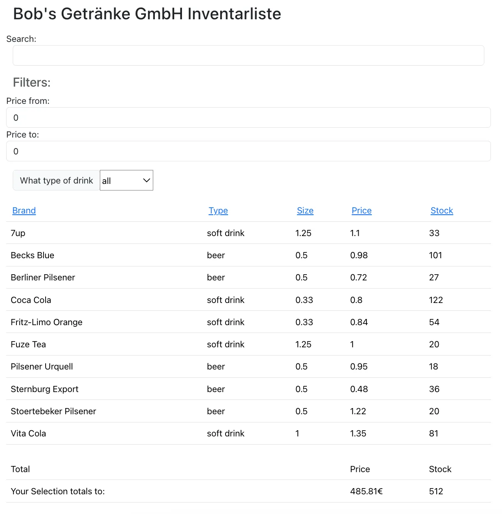
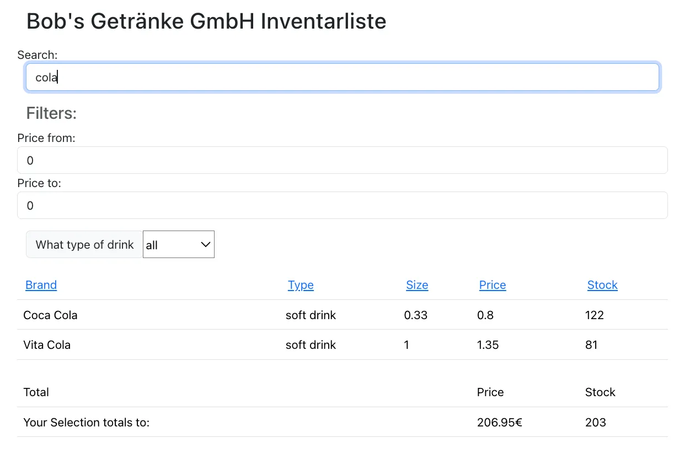
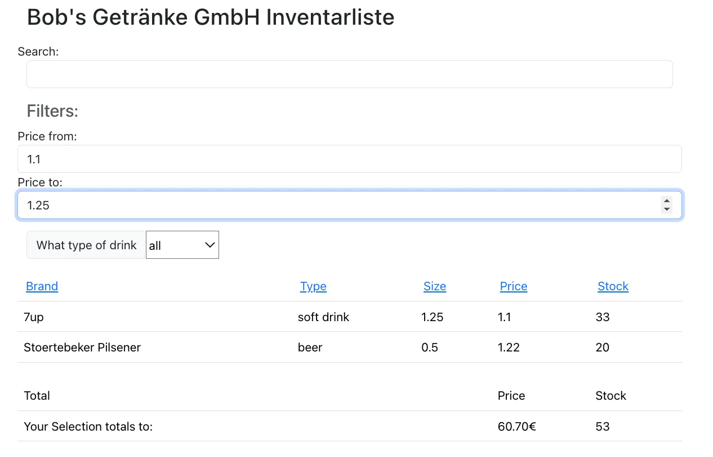
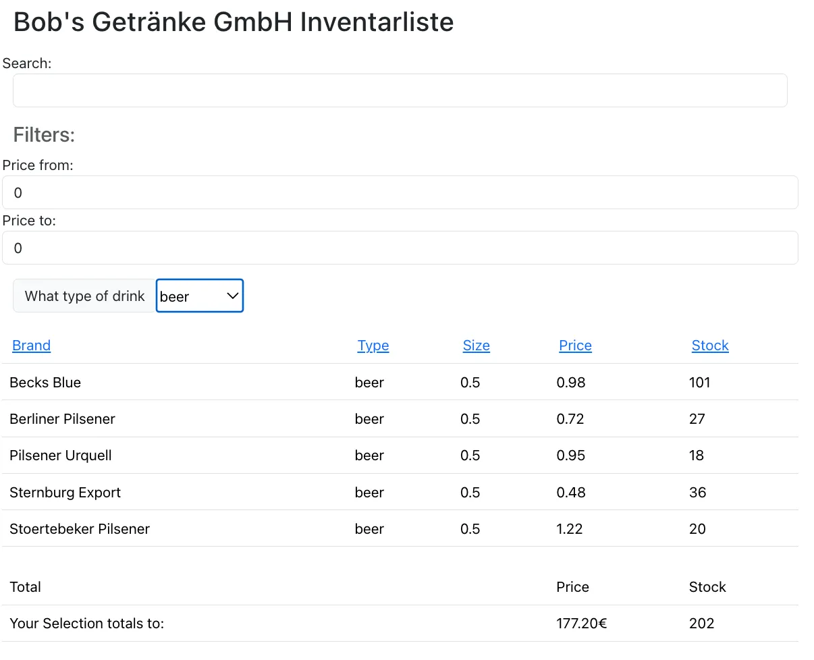
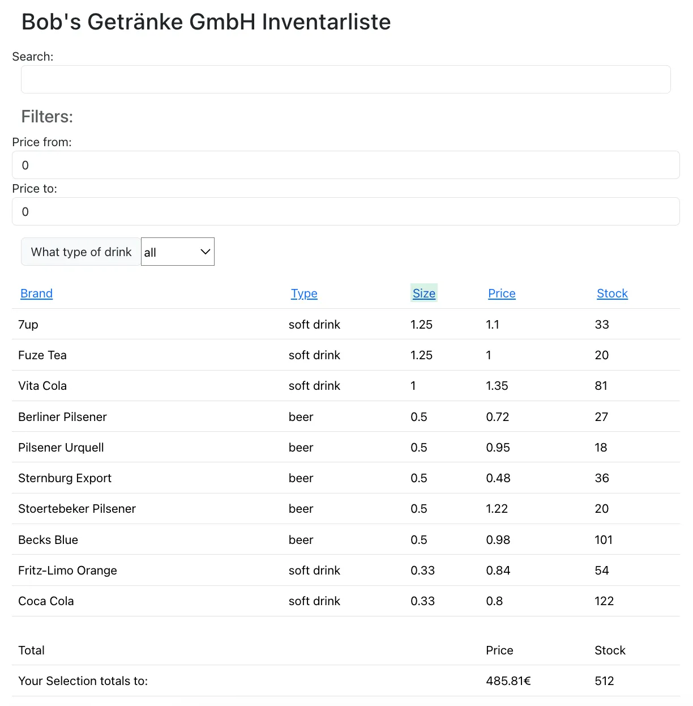
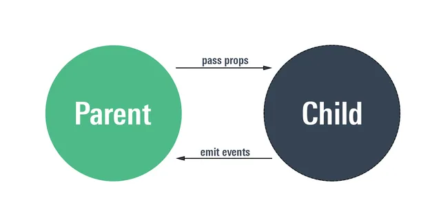
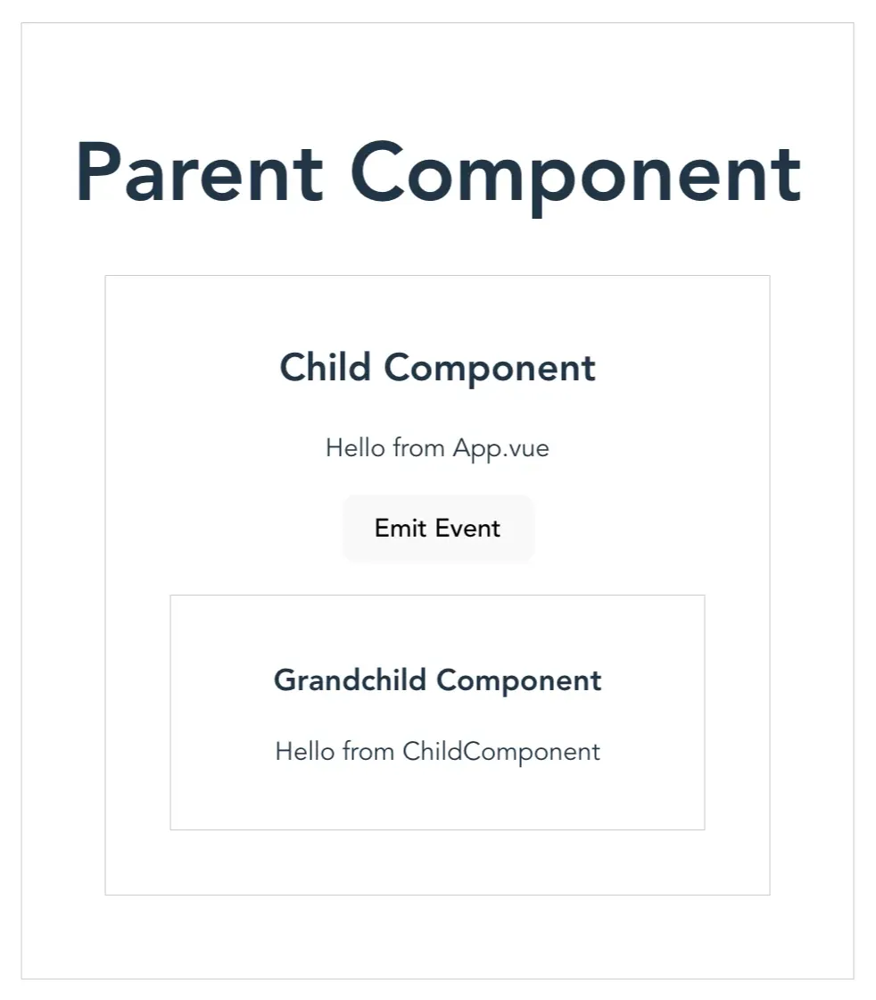
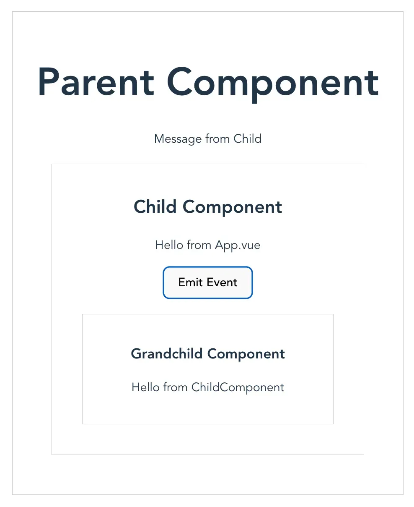

- In Vue.js sind ref, reactive und computed Werkzeuge zur Verwaltung von Zuständen und Reaktivität in einer Vue-Komponente.
- Warum "Reaktivitätswrapper"? Sie "umhüllen" (engl. wrap) Daten oder Berechnungen mit zusätzlicher Funktionalität, um diese reaktiv zu machen.

# 1 Declarative Binding

## 1.1 Bindung primitver Datentypen mit ref


- Definition: `ref` wird verwendet, um reaktive primitive Werte oder Objekte zu erstellen. Es ist die einfachste Möglichkeit, eine reaktive Referenz zu erstellen.
- Besonderheit: Der eigentliche Wert wird über die .value Eigenschaft abgerufen und geändert.

- Deklarative Bindung zwischen HTML-Elementen und JS-Daten wird mit Hilfe von Wrapper-Objekten erzeugt
- Die Methode `**ref()**` nimmt Werte eines beliebigen Datentypes und packt sie in ein Wrapper-Objekt ein
- Ursprünglicher Wert steht in der `**value**`-Eigenschaft des Wrapper-Objekts zur Verfügung
- Im `**<script>**`-Teil einer Komponente muss explizit auf die Eigenschaft `**value**` des Wrapper-Objekts zugegriffen werden, im HTML-Code kann `**value**` weggelassen werden 
- Wrapper-Objekt enthält getter- und setter-Methoden, welche von der Laufzeitumgebung (nicht dem Programmierer) zur Synchronisation mit den HTML-Elementen verwendet werden
- Die Menge der Wrapper-Objekte einer Vue-Instanz wird als _**Reactive State**_ bezeichnet

```vue
<script setup>
const zaehler1 = ref(0) // primitiver dataenstruktur mit Wert 0;  Ihre Referenz wurde an Zaehler zurückgeben


/////////////////////////////////////////
import { ref } from 'vue';

const count = ref(0); // Initialisiert einen reaktiven Zustand
count.value++; // Zugriff und Aktualisierung des Wertes
</script>
```

## 1.2 Object

- Objekte können mit `**ref()**` oder mit `**reactive()**` gewrappt (eingepackt) werden
- Mit `**ref()**` erzeugte Wrapper stellen den Objektwert in der `**value**`-Eigenschaft zur Verfügung
- `reactive()`
    - Mit `**reactive()**` erzeugte Wrapper übernehmen die Eigenschaften des Objekts als Eigenschaften des Wrappers, d.h. es kann ohne `**value**` direkt auf die Eigenschaften zugegriffen werden
    - Werte primitiver Datentypen können nicht mit `**reactive()**` gewrappt werden, nur Objektwerte
    -  Definition: reactive wird verwendet, um ein reaktives Objekt zu erstellen. Es ist ideal für die Arbeit mit komplexen Objekten oder Arrays.
    - Kein .value erforderlich – Zugriff erfolgt direkt auf den Zustand.

- Tipp: verwende `**ref()**` für primitive Datentypen und `**reactive()**` für Objekte

```vue
<script setup>
import { reactive } from 'vue';

const state = reactive({
  count: 0,
  name: 'Vue'
});

state.count++; // Direktzugriff und Aktualisierung
state.name = 'Vue 3';
</script>
```

Bindung von Objekten mit ref


Bindung von Objekten mit Reactive


## 1.3 function

```vue 
<script setup>
import { ref } from 'vue'
const increment = ref(0);
const incrementFct = () => {
    increment.value++;
}

const zaehler1 = ref(0);
const zaehler2 = reactive({ wert: 0 });
const zaehler3 = ref(0);

function increment1() {
  zaehler1.value++;
}

function increment2() {
  zaehler2.wert++;
}
</script>
```


# 2 Direktiven 指令 


- _**Direktiven**_ ermöglichen das Data Binding zwischen HTML-Elementen und Reactive State
- Direktiven in Vue.js sind spezielle Attribute, die man in dem HTML-Code verwenden kann, um dem Vue-Code dynamisches Verhalten zu geben. Sie sind wie "Befehle", die Vue.js sagt, wie es das DOM (die Webseite) manipulieren soll.
- Vue-spezifische HTML-Attribute mit dem Präfix `**v-**`, die vor dem Rendering durch das Framework ersetzt werden
- Unterstützte Direktiven: `**v-text**` (oder `**{{}}**`), `**v-html**`, `**v-show**`, `**v-if**`, `**v-else**`, `**v-else-if**`, `**v-for**`, `**v-on**` (oder `**@eventname**`, `**v-bind**` (oder `**:attributname**`), `**v-model**`, `**v-slot**`, `**v-pre**`, `**v-cloak**`, `**v-memo**`, `**v-once**`


- [v-text](https://vuejs.org/api/built-in-directives.html#v-text) oder [{{ }}](https://vuejs.org/api/built-in-directives.html#v-text): fügt einfachen Text in ein Element ein.
- [v-if](https://vuejs.org/api/built-in-directives.html#v-if): rendert ein Element nur, wenn die Bedingung wahr ist.
    - [v-else](https://vuejs.org/api/built-in-directives.html#v-else): ergänzt v-if, um einen "else"-Block zu definieren.
    - [v-else-if](https://vuejs.org/api/built-in-directives.html#v-else-if): fügt eine "else if"-Bedingung zu v-if hinzu.
- [v-for](https://vuejs.org/api/built-in-directives.html#v-for): erstellt eine Liste, indem über ein Array/Objekt iteriert wird.
- [v-on](https://vuejs.org/api/built-in-directives.html#v-on) oder [@](https://vuejs.org/api/built-in-directives.html#v-on): bindet Event-Listener an DOM-Elemente (z. B. v-on:click="" oder @click=””).
- [v-bind](https://vuejs.org/api/built-in-directives.html#v-bind) oder [:](https://vuejs.org/api/built-in-directives.html#v-bind): bindet dynamische Werte an HTML-Attribute.
- [v-model](https://vuejs.org/api/built-in-directives.html#v-model): Zwei-Wege-Bindung für Formularelemente.
- [v-html](https://vuejs.org/api/built-in-directives.html#v-html): fügt HTML-Inhalt in ein Element ein.
- [v-show](https://vuejs.org/api/built-in-directives.html#v-show): zeigt/verbirgt ein Element basierend auf einer Bedingung (setzt display: none).
- [v-slot](https://vuejs.org/api/built-in-directives.html#v-slot): definiert benannte Slots in Komponenten.
- [v-pre](https://vuejs.org/api/built-in-directives.html#v-pre): überspringt die Kompilierung für das markierte Element.
- [v-once](https://vuejs.org/api/built-in-directives.html#v-once): rendert das Element nur einmal (kein Re-Rendering bei Änderungen).
- [v-memo](https://vuejs.org/api/built-in-directives.html#v-memo): optimiert Wiederverwendungen von Elementen, basierend auf Abhängigkeiten.
- [v-cloak](https://vuejs.org/api/built-in-directives.html#v-cloak): verhindert, dass unkompilierte Templates angezeigt werden (typisch zusammen mit CSS verwendet).

```vue
<script setup>
import { ref } from 'vue'

const show = ref(true)
const list = ref([1, 2, 3])
</script>

<template>
<h2>Example C: Conditional Renedering und Schleifen</h2>
  <button @click="show = !show">Toggle List</button>
  <button @click="list.push(list.length + 1)">Push Number</button>
  <button @click="list.pop()">Pop Number</button>
  <button @click="list.reverse()">Reverse List</button>

  <ul v-if="show && list.length">
    <li v-for="item of list">{{ item }}</li>
  </ul>
  <p v-else-if="list.length">List is not empty, but hidden.</p>
  <p v-else>List is empty.</p>
</template>
```


## 2.1 Direktive v-text

- Einfachste Art des Declarative Rendering
- `**v-text**`-Direktive verknüpft ein Wrapper-Objekt mit dem Inhalt eines HTML-Elements
- `**v-text**` als Attribut im Start-Tag des HTML-Elements (ohne Text zwischen Start- und End-Tag)
- Alternative: Einbettung innerhalb der Tags durch `**{{}}**`
- Beim Rendering wird das Attribut `**v-text**` durch die Vue-Umgebung entfernt und der Wert des Wrapper-Objekts in den DOM eingesetzt
- Data Binding: bei Aktualisierung des Wrapper-Objekts wird ein neues Rendering durchgeführt, so dass die Änderung sofort sichtbar wird
- Variable enthält einfachen Text, kein HTML
- HTML kann durch `**v-html**` eingebettet werden

```vue
<script setup>
import { ref, reactive } from 'vue';

const zaehler1 = ref(0);
const zaehler2 = reactive({ wert: 0 });
const zaehler3 = ref(0);

function increment1() {
  zaehler1.value++;
}

function increment2() {
  zaehler2.wert++;
}
</script>

<template>
<h2>Example A: Data Binding mit ref und reactive | v-on | v-text</h2>
  <div>
    <button v-on:click="increment1">
      {{ zaehler1 }}
    </button>
    Dieser Button wurde {{ zaehler1 }}x geklickt.
  </div>
  <div>
    <button @click="increment2">
      {{ zaehler2.wert }}
    </button>
    Dieser Button wurde {{ zaehler2.wert }}x geklickt.
  </div>
  <div>
    <button @click="zaehler3++" v-text="zaehler3"></button>
    Dieser Button wurde <span v-text="zaehler3"></span>x geklickt
  </div>
</template>
```

---

```vue
<script setup>
  import { ref } from 'vue';
  const message = ref("Hello, Vue!");
</script>

<template>
  <div v-text="message"></div>
</template>
```


## 2.2 Direktive v-bind

- Dynamisierung von HTML-Attributen mit **`v-bind:attributname`** oder mit der Kurzschreibweise `:attributname`
- Als Attributwert wird der Name eines Wrapper-Objekts eingesetzt, deren Wert das Attribut erhalten soll

- Unterstützung van Camel-Case- (camelCase) und Kebab-Case- Schreibweise (kebab-case)

### 2.2.1 `v-bind:style`
- Bei `**:style**` wird ein Wrapper-Objekt inline übergeben, welches die gewünschten CSS-Regeln enthält
```vue
<script setup>
import { ref } from 'vue';
const backColor1 = ref('white');
const backColor2 = ref('white');
</script>

<template>
  <div>
    <strong
      @mouseover="backColor1 = 'red'"
      @mouseout="backColor1 = 'white'"
      v-bind:style="{ 'background-color': backColor1 }"
      >
        Fahre mit dem Mauszeiger über mich
    </strong>
  </div>
  <div>
    <strong
      @mouseover="backColor2 = 'yellow'"
      @mouseout="backColor2 = 'white'"
      :style="{ 'background-color': backColor2 }"
      >
        Fahre mit dem Mauszeiger über mich
    </strong>
  </div>
</template>
```

---


```vue
<script setup>
	import { ref } from 'vue';
	const backgroundColor = ref('');
</script>

<template>
  <div>
    <i
      @mouseover="backgroundColor = 'greenyellow'"
      @mouseout="backgroundColor = ''"
      v-bind:style="{ 'background-color': backgroundColor }">
        Hover your mouse over me!
  </i>
  </div>
</template>
```


### 2.2.2 `v-bind:style`

```js

<script setup>

    function getBadgeColor(tag) {
        switch (tag) {
            case 'Feature':
            case 'Bug':
                return 'text-bg-info';
            case 'In concept':
            case 'Shelved':
            case 'Abandoned':
                return 'text-bg-secondary';
            case 'Assigned':
                return 'text-bg-success';
            case 'Client request':
                return 'text-bg-warning';
            case 'Urgent':
                return 'text-bg-danger';
            default:
                return 'text-bg-light';
        }
    }

    let isExpanded = ref(false)
    
    function toggleDescription() {
        isExpanded.value = !isExpanded.value;
    }
</script>

<template>
	<div class="card bg-light mt-3">
        <h5 class="card-header collapsed">{{ task.title }}</h5>


        <div :class="['card-body', collapsed, getBadgeColor(tagValue) ]" @click="toggleCollapsed()">
			{{ task.text }}
		</div>
		<div class="card-footer">
			<Tag v-for="tag in task.tags" :tag-value="tag" />
		</div>
	</div>

    <div class="card-body">
        <p 
           class="card-text description" 
           v-bind:class="{ truncated: !isExpanded }"   //  当 !isExpanded 为 true 的时候, 会给 p element 加上 truncated 这个 css style, 这时候 description 不在生效, .description.truncated 的权重 大于 .description. .description.truncated  会变得生效 
           @click="toggleDescription()">
            {{ taskProp.text }}
        </p>
    </div>

</template>

<style scoped>
	.collapsed {
		overflow: hidden;
		white-space: nowrap;
		text-overflow: ellipsis;
		cursor: pointer;
	}

    .description {
        cursor: pointer;
        transition: all 0.3s;
    }
    
    .description.truncated {
        white-space: nowrap;
        overflow: hidden;
        text-overflow: ellipsis;
        cursor: pointer;
    }
</style>
```


例子2
```js

<script setup>
import { ref } from 'vue';
defineProps(['tasksProperty']);
emit = defineEmits(['removedTask']);
</script>

<template>
	<ul>

    < !-- // :key = "index 特意告诉 vue 用 index 作为 key, 因为这个 list 是动态的, 有可能会有重复的 key.  用key 的值 (就是 index 的值 ) 来区分 task 是相同的还是不通 , 以此来确定是否为 不同的 list-element -> 
    < !-- :class="{ completed: task.completed }"   // : 就是 v-bind:, dynamischr vindung von class.  completed: true 的时候,  completed 这个 clase 被使用 .  completed: false 的时候, completed 这个 class 不被使用 .   completed class 这个css class 在同一个文档最下面被定义,  他用来改变背景颜色 .  .completed .task-text  用来定义 element 中的文字被划横线或者不被画横线 -> 
    < !-- v-model="task.completed"  // 当 checkbox 被选上的时候, task.completed 会变成 true, 从而触发 class 的变化. 他原本是 false  ->
		<li v-for="(task, index) in tasksProperty"
	    :key = "index"  
      class="task-item"
      :class="{ completed: task.completed }"  
	  >
			<input 
		    type="checkbox" 
	      class="checkbox" 
	      v-model="task.completed"
      >

	    <span class="task-text" v-text="task.name"></span>
	    
      <button id="removeBtn"   @click="$emit('removedTask', index )"            >-</button>
	  </li>
  </ul>
</template>


<style>
<!--  用来定义element中的文字被划横线或者不被画横线->
.completed .task-text {   
	text-decoration: line-through;
	font-style: italic;
  color: gray;
}

.completed {
	background-color: #f0f0f0;
}
</style>
```

## 2.3 Direktiv v-if 

```vue
<script setup>
import { ref } from 'vue'

const show = ref(true)
const list = ref([1, 2, 3])
</script>

<template>
<h2>Example C: Conditional Renedering und Schleifen</h2>
  <button @click="show = !show">Toggle List</button>
  <button @click="list.push(list.length + 1)">Push Number</button>
  <button @click="list.pop()">Pop Number</button>
  <button @click="list.reverse()">Reverse List</button>

  <ul v-if="show && list.length">
    <li v-for="item of list">{{ item }}</li>
  </ul>
  <p v-else-if="list.length">List is not empty, but hidden.</p>
  <p v-else>List is empty.</p>
</template>
```

- `**v-if**` ermöglicht das bedingte Einblenden von HTML-Elementen und beeinflusst damit die Struktur des DOM
- Attributwert entspricht einem Ausdruck, der zu einem Wahrheitswert berechnet wird
- Bei `**true**` wird das enthaltende HTML-Element gerendered, bei `**false**` nicht 


---


```vue
<script setup>
	import { ref } from 'vue'
  const increment = ref(0);
</script>

<template>
  <div>
    <p v-if="increment == 0">Hello! The number is: {{ increment }}</p>
    <p v-else-if="increment % 2 == 0">The number {{ increment }} is even.</p>
    <p v-else>The number {{ increment }} is odd.</p>

    <button v-on:click="increment++">Click me!</button>
  </div>
</template>
```

上下两个 block 是等效的 
```vue
<script setup>
	import { ref } from 'vue'
  const increment = ref(0);
  const incrementFct = () => {
    increment.value++;
  }
</script>

<template>
  <div>
    <p v-if="increment == 0">Hello! The number is: {{ increment }}</p>
    <p v-else-if="increment % 2 == 0">The number {{ increment }} is even.</p>
    <p v-else>The number {{ increment }} is odd.</p>

    <button v-on:click="incrementFct">Click me!</button>
  </div>
</template>
```

## 2.4 Direktiv v-for

- `**v-for**` iteriert durch ein Array und fügt für jeden Eintrag ein HTML-Element hinzu
- Attributwert hat die Form "`**zählvariable in Arrayname**`"
- Über die Zählvariable kann dann auf das jeweilige Element des Arrays zugegriffen werden

---


```vue
<script setup>
  import { ref } from 'vue';
  const items = ref(["Item 1", "Item 2", "Item 3"])
</script>

<template>
  <ul>
    <li v-for="(item, index) in items" :key="index">
      {{ item }}
    </li>
  </ul>
</template>
```


## 2.5 Direktive v-model  (Two Way Data Binding)

- Die Direktive `**v-model**` ermöglicht _**Two Way Data Binding**_ 
- Benutzereingaben werden unmittelbar in das hinterlegten Wrapper-Objekt gespeichert (erster Weg) und beim Rendering unmittelbar angezeigt (zweiter Weg)

```vue
<script setup>
import { ref } from 'vue'

const text = ref('Edit me')
const checked = ref(true)
const checkedNames = ref(['Jack'])
const picked = ref('One')
const selected = ref('A')
const multiSelected = ref(['A'])
</script>

<template>
  <input v-model="text"> {{ text }}

  <h2>Checkbox</h2>
  <input type="checkbox" id="checkbox" v-model="checked">
  <label for="checkbox">Checked: {{ checked }}</label>

  <h2>Multi Checkbox</h2>
  <input type="checkbox" id="jack" value="Jack" v-model="checkedNames">
  <label for="jack">Jack</label>
  <input type="checkbox" id="john" value="John" v-model="checkedNames">
  <label for="john">John</label>
  <input type="checkbox" id="mike" value="Mike" v-model="checkedNames">
  <label for="mike">Mike</label>
  <p>Checked names: <pre>{{ checkedNames }}</pre></p>

  <h2>Radio</h2>
  <input type="radio" id="one" value="One" v-model="picked">
  <label for="one">One</label>
  <br>
  <input type="radio" id="two" value="Two" v-model="picked">
  <label for="two">Two</label>
  <br>
  <span>Picked: {{ picked }}</span>
```


```vue
  <h2>Select</h2>
  <select v-model="selected">
    <option disabled value="">Please select one</option>
    <option>A</option>
    <option>B</option>
    <option>C</option>
  </select>
  <span>Selected: {{ selected }}</span>

  <h2>Multi Select</h2>
  <select v-model="multiSelected" multiple style="width:100px">
    <option>A</option>
    <option>B</option>
    <option>C</option>
  </select>
  <span>Selected: {{ multiSelected }}</span>
</template>
```

---


```vue
<script setup>
	import { ref } from 'vue'
  const inputValue = ref('');
</script>

<template>
  <textarea rows="5" cols="50" v-model="inputValue" placeholder="Type something..." />
  <p>You typed: {{ inputValue }}</p>
</template>
```


## 2.6 Direktive v-on (Event Listener )

- Event Listener können als Attribute mit `**v-on:eventname**` oder `**@eventname**` referenziert werden

Method Handler
- Als Event Handler wird eine Methode spezifiziert
- Method Handler ist eine Referenz auf eine im Script-Teil oder anderswo definierte Funktion, kein Funktionsaufruf  


```vue
<script setup>
import { ref, reactive } from 'vue';
const zaehler1 = ref(0);
const zaehler2 = reactive({ wert: 0 });
const zaehler3 = ref(0);
function increment() {
  zaehler1.value++;
}
</script>

<template>
...
  <button v-on:click="increment">
      {{ zaehler1 }}
  </button>
...
</template>
```

---

Inline Handler
- Als Event Handler wird eine JS-Code inline spezifiziert
- Inline Handler erlauben einen Funktionsaufruf im Code, z.B. wenn Argumente an die aufzurufende Funktion übergeben werden sollen

```vue
<script setup>
import { ref } from 'vue'
const show = ref(true)
const list = ref([1, 2, 3])
</script>

<template>
...
  <button @click="show = !show">Toggle List</button>
  <button @click="list.push(list.length + 1)">Push Number</button>
  <button @click="list.pop()">Pop Number</button>
  <button @click="list.reverse()">Reverse List</button>
...
</template>
```


---


```vue
<script setup>
	import { ref } from 'vue'
	const count = ref(0)
</script>

<template>
  <button @click="count++">Count is: {{ count }}</button>
</template>

<style scoped>
	button {
	  font-weight: bold;
	}
</style>
```


# 3 Direktiv 大例子

Vue.js Einführung: Bob’s Getränke GmbH

Single-page Applications sind Webapplikationen, die aus nur einer einzigen Webseite Bestehen. Dabei lädt die JavaScript-Engine im Browser asynchron im JSON- oder XML-Format und fügt sie dynamisch in das Document Object Model (DOM) der geladenen Webseite ein.

Da imperative DOM-Manipulation mit JavaScript aber aufwändig, unübersichtlich und schwerfällig ist (wie Sie in der Vorlesung gesehen haben), gibt es eine Vielzahl von JavaScript-Frameworks, die Entwicklern durch sogenanntes declarative Rendering eine Abstraktionsschicht bieten. Beim declarative Rendering müssen Entwickler lediglich die Abhängigkeiten zwischen den Elementen und Attributen des DOM und den Daten der Geschäftslogik der Applikation beschreiben. In diesem Modul arbeiten wir hierfür mit Vue.js v3 (https://v3.vuejs.org/).

Wir haben bisher mithilfe nativer JavaScript-Listenfunktionen Operationen auf der Inventarliste der Bob’s Getränke GmbH ausgeführt. Nun wollen wir diese Inventarliste mithilfe von Vue.js im Browser darstellen und Such-, Filter- und Sortierfunktionen bereitstellen. Dazu ist Ihnen in der Vorgabe die Datei App.vue gegeben. Ihre Aufgabe ist es, die fehlenden Vue.js-Direktiven und -Methoden zu ergänzen, um folgende Funktionalitäten zu implementieren:
1.) Verknüpfen Sie die vorgegebene Tabelle mit dem Array stock, sodass für jeden Eintrag im Array eine Zeile in der Tabelle erzeugt wird.
2.) Ergänzen Sie die letzte Zeile der Tabelle, um für die angezeigten Getränke die Summen der Preise und Vorratsbestände anzugeben. Werden keine Getränke angezeigt (z.B. weil keine dem gegebenen Filter entsprechen), soll statt der Summen “Nothing selected” angezeigt werden.
3.) Ergänzen Sie die Methode filteredStock um Filter nach einer Preisspanne (siehe Variablen priceFrom und priceTo) und dem Getränketyp (siehe Variable typeFilter). Ergänzen Sie außerdem im Filterformular der Webseite die fehlenden Vue-Direktiven, um die Eingabefelder des Formulars mit den entsprechenden Variablen und Methoden zu verknüpfen.
4.) Ergänzen Sie die Links im Kopf der Tabelle um entsprechende Vue-Direktiven, damit man die Einträge nach der entsprechenden Eigenschaft sortieren kann. Die Sortierfunktionalität ist Ihnen bereits in der Methode filteredStock gegeben, sie müssen sie also nicht selbst implementieren.


```vue
<script setup>
import {ref, reactive, computed} from 'vue';
import 'bootstrap/dist/css/bootstrap.min.css';
import 'bootstrap';

const sortparam = ref('brand');
const filterkey =  ref('');
const priceFrom = ref('');
const priceTo = ref('');
const typeFilter = ref('all');
const order =  ref(1);

const stock = reactive([
					{
						brand: "Berliner Pilsener",
						type: "beer",
						size: 0.5,
						price: 0.72,
						stock: 27
					},
					{
						brand: "Vita Cola",
						type: "soft drink",
						size: 1,
						price: 1.35,
						stock: 81
					},
					{
						brand: "Pilsener Urquell",
						type: "beer",
						size: 0.5,
						price: 0.95,
						stock: 18
					},
					{
						brand: "Sternburg Export",
						type: "beer",
						size: 0.5,
						price: 0.48,
						stock: 36
					},
					{
						brand: "Stoertebeker Pilsener",
						type: "beer",
						size: 0.5,
						price: 1.22,
						stock: 20
					},
					{
						brand: "Fritz-Limo Orange",
						type: "soft drink",
						size: 0.33,
						price: 0.84,
						stock: 54
					},
					{
						brand: "7up",
						type: "soft drink",
						size: 1.25,
						price: 1.10,
						stock: 33
					},
					{
						brand: "Fuze Tea",
						type: "soft drink",
						size: 1.25,
						price: 1,
						stock: 20
					},
					{
						brand: "Coca Cola",
						type: "soft drink",
						size: 0.33,
						price: 0.80,
						stock: 122
					},
					{
						brand: "Becks Blue",
						type: "beer",
						size: 0.5,
						price: 0.98,
						stock: 101
					}
				]);

const filteredStock = computed(() => {
  return stock
/* 8.5.3: hier filter anwenden */
    .filter((drink) => drink.brand.toLowerCase().includes(filterkey.value))
    .filter((drink) => drink.price >= priceFrom.value)
    .filter((drink) => drink.price <= priceTo.value || priceTo.value == 0)
    .filter((drink) => drink.type == typeFilter.value || typeFilter.value == "all")
    .sort((a, b) => {
      if (a[sortparam.value] < b[sortparam.value]) {
        return (-1) * order.value;
      }
      if (a[sortparam.value] > b[sortparam.value]) {
        return 1 * order.value;
      }
      return 0;
    });
});

function changeSortParam(sortParam) {
  sortparam.value = sortParam;
  order.value = order.value * (-1);
}
		
</script>

<template>
  <main>
    <div id="app" class="container mt-4">
      <h2>Bob's Getränke GmbH Inventarliste</h2>
      <div class="row mt-3">Search:</div>
  
      <input type="text" class="form-control mb-3" v-model="filterkey">
      <h4 class="text-muted">Filters:</h4>
      <div class="row">
        Price from:
        <input type="number" class="form-control col-3 ml-3 mr-3" min="0" v-model="priceFrom">
        Price to: 
        <input type="number" class="form-control col-3 ml-3" min="0"  v-model="priceTo">
        <div class="input-group mb-3 mt-3 col-6">
          <div class="input-group-prepend">
            <label class="input-group-text" for="inputGroupSelect">What type of drink</label>
          </div>
          <select class="custom-select" id="inputGroupSelect" v-model="typeFilter">
            <option value="all" selected>all</option>
            <option value="soft drink">soft drink</option>
            <option value="beer">beer</option>
          </select>
        </div>
  
        <table class="table table-hover">
            <thead>
            <!--8.1.4-->
          <tr>
            <th><a href="#" v-on:click="changeSortParam('brand')">Brand</a></th>
            <th><a href="#" @click="changeSortParam('type')">Type</a></th>
            <th><a href="#" v-on:click="changeSortParam('size')">Size</a></th>
            <th><a href="#" v-on:click="changeSortParam('price')">Price</a></th>
            <th><a href="#" v-on:click="changeSortParam('stock')">Stock</a></th>
          </tr>
            </thead>
    
            <tbody>
            <!-- 8.1.2 -->
            <tr v-for="drink in filteredStock">
                <td v-text="drink.brand"></td>
                <td v-text="drink.type"></td>
                <td v-text="drink.size"></td>
                <td v-text="drink.price"></td>
                <td > {{ drink.stock }}</td>
              </tr>
            </tbody>
            <thead>
            <tr>
            <th>Total</th>
            <th></th>
            <th></th>
            <th>Price</th>
            <th>Stock</th>
            </tr>
            </thead>
            <tbody>
              <!-- 8.5.2 -->
              <tr>
                <td>Your Selection totals to:</td>
                <td></td>
                <td></td>
                <td  v-text=" filteredStock.reduce((acc, cur) => (acc + cur.price * cur.stock), 0).toFixed(2) + '€' "> </td>
                <td>{{ filteredStock.reduce((acc, cur) => acc + cur.stock, 0) }}</td>
              </tr>
              <tr>
              <!-- falls nichts ausgewählt ist, soll Nothing selected ausgegeben werden -->
                <td>Nothing selected</td>
              </tr>
            </tbody>
        </table>
      </div>
</div>
  </main>
</template>

<style scoped>

</style>
```




Filtern nach dem Namen


Filtern nach der Preis



Filtern nach dem Type



Sortieren durch Klick auf die `<a>-Elemente`


# 4 Abfangen von event-Objekten

- Wird der Event Handler als Method Handler hinterlegt, übergibt die Laufzeitumgebung bei Aufruf ein `**event**`-Objekt (siehe Folien zu `**addEventListener**`)
- `**event**`-Objekt ist Standard-JS und wird genutzt, um HTML-Element zu identifizieren, auf dem Event ausgelöst wurde

```vue
<script setup>
import { ref, reactive } from 'vue';
const name = ref('Vue.js')

function greet(event) {
  alert(`Hello ${name.value}!`)
  // `event` is the native DOM event
  if (event) {
    alert(event.target.tagName)
  }
}
</script>

<template>
...
  <button @click="greet">Greet</button>
...
</template>
```


---

- Bei Aufruf eigener Funktionen in Method Handlern kann das `**event**`-Objekt abgefangen werden und an die aufgerufene Funktion als Argument übergeben werden
- Zugriff auf das Event durch die vue-Systemvariable `**$event**` oder als frei wählbarer Name bei Definition einer Pfeilfunktion

```vue
<script setup>
function warn(message, event) {
  // now we have access to the native event
  if (event) {
    event.preventDefault()
  }
  alert(message)
}
</script>

<template>
<button @click="warn('Form cannot be submitted yet.', $event)">
  Submit
</button>
...
<button @click="(event) => warn('Form cannot be submitted yet.', event)">
  Submit
</button>
</template>
```


# 5 Computed Properties

- _**Computed Properties**_ sind Eigenschaften einer Vue-Instanz, deren Werte automatisch berechnet werden, wenn sich abhängige Wrapper-Objekte ändert
- Definition: computed wird verwendet, um abgeleitete Zustände (auch berechnete Eigenschaften) zu erstellen, die von anderen reaktiven Daten abhängen.
- ==Methode `**computed()**` nimmt eine getter-Methode als Argument==, die ein Computed Property berechnet sobald sich eines der in enthaltenen Wrapper-Objekte ändert
- getter-Methode wird automatisch durch Laufzeitumgebung bei Änderung des Wrapper-Objekts aufgerufen, um den aktuellen Wert des Computed Property zu berechnen

```vue
<script setup>
import { computed, ref } from 'vue';

const count = ref(0);
const doubleCount = computed(() => count.value * 2); // Abgeleitete Eigenschaft

count.value++; // Aktualisierung des Ursprungswertes
console.log(doubleCount.value); // Gibt automatisch aktualisierte Werte zurück
</script>
```


Beispiel: Änderung des Reactive State `**filterKey**`, `**sortParam**` und `**order**` führt zu Neuberechnung von `**students**`

```vue
<script setup>
import { ref, reactive, computed } from 'vue';

const students = reactive([
  { id: '001', name: 'Tanja' },
  { id: '002', name: 'Markus' },
  { id: '003', name: 'Michaela' },
  { id: '004', name: 'Thomas' },
  { id: '005', name: 'Peter' },
  { id: '006', name: 'Claudia' },
  { id: '007', name: 'Berta' },
  { id: '008', name: 'Jonas' },
  { id: '009', name: 'Andrea' },
  { id: '010', name: 'Sandra' },
  { id: '011', name: 'Tobias' },
  { id: '012', name: 'Katerina' },
  { id: '013', name: 'Sandro' },
  { id: '014', name: 'Sebastian' },
  { id: '015', name: 'Kai' },
  { id: '016', name: 'Nicole' },
]);
const sortParam = ref('id');
const filterKey = ref('');
const order = ref(1);

const filteredStudents = computed(() => {
  return students   // return students 的作用是 先把 students list show 出来 
    .filter((student) => {
      return student.name.includes(filterKey.value);
    })
    .sort((a, b) => {
      if (a[sortParam.value] < b[sortParam.value]) {
        return -1 * order.value;
      }
      if (a[sortParam.value] > b[sortParam.value]) {
        return 1 * order.value;
      }
      return 0;
    });
});
</script>

<template>
<h2>Example E: Sortieren und Filtern</h2>
    <div>Search:</div>
    <input type="text" v-model="filterKey" />

    <table>
      <thead>
        <tr>
          <th>
            <a
              href="#"
              v-on:click="
                sortParam = 'id';
                order = order * -1;
              "
              >ID</a
            >
          </th>
          <th>
            <a
              href="#"
              v-on:click="
                sortParam = 'name';
                order = order * -1;
              "
              >Name</a
            >
          </th>
        </tr>
      </thead>

      <tbody>
        <tr v-for="student in filteredStudents">
          <td>{{ student.id }}</td>
          <td>{{ student.name }}</td>
        </tr>
      </tbody>
    </table>
</template>
```


# 6 Properties und Emits



1 Props (Properties) sind eine Möglichkeit, Daten von einer Eltern- zu einer Kind-Komponente zu übergeben. Sie erlauben es, eine Komponente flexibel und wiederverwendbar zu gestalten, indem sie dynamische Werte als Eingabe erhält.

property
    - htlml 的 attribute 的值 

Verwendung:
- Props werden in der Kind-Komponente definiert.   child component 中 定义 property. 这个 child-komponent 就知道, 我将从 eltern komponent 中收到一个关于这个 property 的 一个 事件  
- Die Eltern-Komponente übergibt Werte an die Props.  就是在 parent conponent 中 给出 这个 property 的值

---


2 Emits ermöglichen es einer Kind-Komponente, Ereignisse (Events) an die Eltern-Komponente zu senden. Das ist wichtig für die Kommunikation, wenn die Kind-Komponente etwas erledigt oder wenn Benutzerinteraktionen auftreten.
Verwendung:
- In der Kind-Komponente wird ein Event mit this.$emit() ausgelöst.
- Die Eltern-Komponente hört auf dieses Event.


`$event` ist ein spezieller Platzhalter, der das Standard-Event-Objekt oder den Wert repräsentiert, der von einem Event übergeben wird. Es wird verwendet, um Daten aus dem Event-Listener weiterzugeben.

> 在 kindcoponent 中 定义的 property 和 emit 的名字, 也必须在 elterncomponent 中用同样的名字 

## 6.1 Deklaration von Properties und Emits 

defineProps: Statische Deklaration von Eingabe-Properties
1. defineProps wird verwendet, um die Props (Eingabeparameter) einer Komponente zu deklarieren.
2. Props werden von der übergeordneten Komponente übergeben und in der Komponente als reaktive Daten verfügbar gemacht.
3. Props sind immer in der Komponente reaktiv und stehen ohne weitere Zuweisung zur Verfügung.
4. Da defineProps keine Rückgabewerte hat, wird es direkt verwendet:

```v
defineProps([
	'title', 
	'count'
]);

defineProps({
  title: String,
  count: Number,
});
```


### 6.1.1 Literal Props

- **_Properties_** definieren Daten, die vom umgebenden Elternelement an die Komponente übergeben werden
- Properties werden durch die Methode `**defineProps**` in der Komponente definiert
- **_Literal Props_** übergeben die Daten durch ein Attribut, welches den Namen der Property hat, im HTML-Element, welches die Komponente repräsentiert (siehe nächste Folie für Dynamische Props)
- Literal Props sind statisch und können sich nicht ändern
- Properties können nur von Elternelementen an die eingebetteten Komponenten übergeben werden, nicht umgekehrt

App.vue  (这个是 Elternelement)
```vue
<script setup>
import ButtonCounterA from './buttoncounter-a.vue';
</script>

<template>
<h2>Example A: Literal Props</h2>
  <ButtonCounterA title="Anzahl Autos"></ButtonCounterA>
  <ButtonCounterA title="Anzahl Fahrräder"></ButtonCounterA>
  <ButtonCounterA title="Anzahl Fußgänger"></ButtonCounterA>
</template>
```


buttoncounter-a.vue.vue 
```vue
<script setup>
import { ref } from 'vue';
const count = ref(0);
const props=defineProps(['title']);
console.log(props.title);
</script>

<template>
  <button @click="count++">{{title}}: {{count}}</button>
</template>
```


### 6.1.2 Dynamische Props 

- **_Dynamische Props_** können sich zur Laufzeit ändern
- Übergabe der Daten vom Elternelement an die Komponente erfolgt dann durch die bekannten Direktiven

App.vue  (这个是 Elternelement)
```vue
<script setup>
import ButtonCounterA from './buttoncounter-a.vue';
import { reactive } from 'vue';
const labels = reactive([
  { text: 'Anzahl Autos' },
  { text: 'Anzahl Fahrräder' },
  { text: 'Anzahl Fußgänger' },
]);
</script>

<template>
  <h2>Example B: Dynamische Props</h2>
  <ButtonCounterA v-for="label in labels" :title="label.text"></ButtonCounterA>
</template>
```


buttoncounter-a.vue.vue 
```vue
<script setup>
import { ref } from 'vue';
const count = ref(0);
const props=defineProps(['title']);
console.log(props.title);
</script>

<template>
  <button @click="count++">{{title}}: {{count}}</button>
</template>
```


## 6.2 Deklaration von Emits

defineEmits: Dynamisches Auslösen von Events
- defineEmits wird verwendet, um Ereignisse zu deklarieren, die von der Komponente ausgelöst werden können.
- Die Funktion defineEmits gibt eine Methode zurück, mit der Ereignisse ausgelöst werden können. Daher muss ihr Rückgabewert einer Variablen zugewiesen werden, damit man diese Methode später verwenden kann.
- Ein emit-Objekt wird benötigt, um Ereignisse programmatisch auszulösen.


- Komponenten können Ereignisse an die einbettenden Elternelemente propagieren
- `**$emit**` ist eine Vue-interne Methode zum Propagieren von Custom Events
- **_Custom Events_** haben einen frei wählbaren Namen, der als erstes Argument an `**$emit**` übergeben wird
- Ein optionaler zweites Argument von `**$emit**` kann verwendet werden, um einen Wert zu übergeben, der mittels `**$event**` abgefragt werden kann   
    -  `$event` ist ein spezieller Platzhalter, der das Standard-Event-Objekt oder den Wert repräsentiert, der von einem Event übergeben wird. Es wird verwendet, um Daten aus dem Event-Listener weiterzugeben.
- Event Listener wird mit `**v-on:_Eventname_**` im Elternelement definiert

Child component 中 
```js
<script setup>

defineProps(['title']);

const emit = defineEmits([
	'increment',
	'decrement', 
	'increment-counter'
]);

// 或者直接写成如下, 不加入 emit 也可以用 
defineEmits([
	'increment',
	'decrement'
]);

const emit = defineEmits({
increment: null,
decrement: null,
});

</script>

```

### 6.2.1 例子


1  

buttencounter-b.vue    (Child Component)
```vue
<script setup>
import { ref } from 'vue';
const count = ref(0);
defineProps(['title']);
defineEmits(['increment-counter']);

const emit = defineEmits(['increment-counter']);

function incrementCounter() {
    emit('increment-counter', count)
}


</script>

<template>
  <button @click="$emit('increment-counter')">{{title}}</button>  // $emit('increment-counter')  触发了 increment-counter 这个 event 
    
  <button @click="incrementCounter">{{title}}</button> 

</template>
```


App.vue  (这个是 Parent component)
```vue
<script setup>
import ButtonCounterB from './buttoncounter-b.vue';
import { reactive } from 'vue';
const labels = reactive([
  { text: 'Anzahl Autos', count: 0 },
  { text: 'Anzahl Fahrräder', count: 0 },
  { text: 'Anzahl Fußgänger', count: 0 },
]);
</script>

<template>
  <h2>Example C: Ereignisse</h2>
  <h3 v-for="label in labels">{{label.text}}: {{label.count}}</h3>
  <ButtonCounterB v-for="label in labels" :title="label.text" @increment-counter="label.count+=1;"> </ButtonCounterB>  // increment-counter 这个 event 的名字 是定义在 buttencounter-b.vue中. child component 中increment-counter 这个 event 被触发. 然后 在 parent component 层面   label.count+=1 这个 function 被执行 
</template>
```


2  使用 $emit, $event 带 payload 

$emit wird verwendet, um benutzerdefinierte Ereignisse von einer Kind-Komponente an eine Eltern-Komponente zu senden. ==Damit können Daten (Payload) oder Signale von der Kind-Komponente an die Eltern-Komponente weitergegeben werden.== Es wird meistens in Reaktion auf Benutzeraktionen wie Klicks oder Änderungen ausgelöst.

```vue
<!-- in Kindkomponente -->

<script setup>
	const emit = defineEmits(['eventName1', 'eventName2']);
	const count = ref(0);

    // 或者 
    function eventName1() {
        emit('increment-counter', count)   // count 就是 payload, 返回给 parent component 
    }
</script>

<template>
    <Element @click="$emit('eventName1', payload)">irgendetwas amk</Element> // 将 payload 发射给 eltern Komponent 
    <Element @click="eventName1">irgendetwas amk</Element> 
</template>
```


---


$event ist ein spezieller Platzhalter, der die vom $emit gesendeten Daten oder das Standard-Event-Objekt repräsentiert. In der Eltern-Komponente kann $event genutzt werden, um die gesendeten Daten oder das Ereignisobjekt zu empfangen. Damit kann die Eltern-Komponente flexibel auf die Aktionen der Kind-Komponente reagieren.
```vue
<!-- in Elternkomponente -->

<script setup>
	import KindKomponente from "./components/KindKomponente.vue";
	import { ref } from "vue";

	const parentMessage = ref("Hello from App.vue");
	const messageFromChild = ref("");
	const isVisible = ref(false);

	const handleChildEvent = (message) => {
	  messageFromChild.value = message;
	  isVisible.value = !isVisible.value;
	};
</script>


<KindKomponente @eventName1="handleChildEvent($event)" />   // $event 代表 从 KindKomponente 中发从过来的 payload 这个 attribue 中的值 
```


## 6.3 Einfaches Beispiel


- Kann immer nur an das Kind gesendet werden oder auch direkt an das Grandchild?
    - nur an das Kunder, nicht direkt an das Grandchild
-  两个 element komponent 用同一个 childevent , 是可以的, 这时候 会引起 datenkollision , 因为处理的是相同数据 

App.vue
```vue
<script setup>
	import ChildComponent from "./components/ChildComponent.vue";
	import { ref } from "vue";

	const parentMessage = ref("Hello from App.vue");
	const messageFromChild = ref("");
	const isVisible = ref(false);

	const handleChildEvent = (message) => {
	  messageFromChild.value = message;
	  isVisible.value = !isVisible.value;
	};
</script>

<template>
  <div id="app">
    <h1>Parent Component</h1>
    <p v-if="isVisible" style="margin-top: 10px">{{ messageFromChild }}</p>
    <ChildComponent
      :childProp="parentMessage"     // childProp 定义在 ChildComponent 中 
      @childEvent="handleChildEvent($event)" // childEvent 这个 event 创建定义在 ChildComponent 中
    />
  </div>
</template>

<style scoped>
	div {
	  border: 1px solid #ccc;
	  font-family: Avenir, Helvetica, Arial, sans-serif;
	  text-align: center;
	  margin-top: 50px;
	}
</style>
```


ChildComponent.vue
```vue
<script setup>
	import GrandchildComponent from "./GrandchildComponent.vue";
	import { ref } from "vue";

	defineProps(['childProp']);
	const emit = defineEmits(['childEvent']);

	const messageFromChild = ref("Message from Child");
	const grandchildMessage = ref("Hello from ChildComponent!");
</script>

<template>
	<div>
	  <h2>Child Component</h2>
    <p>{{ childProp }}</p>
    <button @click="$emit('childEvent', messageFromChild)">Emit Event</button>
    <GrandchildComponent
      :grandchildProp="grandchildMessage"/>
  </div>
</template>

<style scoped>
	div {
	  border: 1px solid #ccc;
	  padding: 20px;
	  margin: 20px;
	}
</style>
```


GrandchildComponent.vue
```vue
<script setup>
	defineProps(['grandchildProp']);
</script>

<template>
  <div>
		<h3>Grandchild Component</h3>
    <p>{{ grandchildProp }}</p>
  </div>
</template>

<style scoped>
	div {
	  border: 1px dashed #999;
	  padding: 10px;
	  margin: 10px;
	}
</style>
```








# 7 watch

`watch` eine Funktion, die verwendet wird, um reaktiv auf Änderungen von bestimmten reaktiven Datenquellen (z. B. `ref`, `reactive` Daten oder berechnete Eigenschaften) und führt eine Callback-Funktion aus, wenn der überwachte Wert sich ändert.

Es eignet sich gut, wenn du spezifische Aktionen bei Änderungen eines Werts ausführen möchtest, z. B. API-Aufrufe, Event-Emitter oder andere nicht-datengesteuerte Operationen.


## 7.1 syntax

```js
watch(source, callback, [options])
```


source: Die zu überwachende Datenquelle. Das kann ein einzelner ref, eine reactive Eigenschaft, eine Funktion oder ein Array von Quellen sein.

callback: Eine Funktion, die aufgerufen wird, wenn sich der source ändert.
```js
watch(typeFilter, newValue => emit('typeFilter', newValue));
```

options: Zusätzliche (optionale) Optionen wie `immediate` (führt den Callback sofort aus) oder `deep` (tiefes Überwachen bei Objekten).


## 7.2 例子

```js
<template>
  <label for="search">Suche nach einem Raum: </label>
  <input type="text" id="search" v-model="searchKey" />
</template>

<script setup>
import { ref, computed, watch } from 'vue';

const emit = defineEmits(['search-room']);
const props = defineProps(['rooms']);

const searchKey = ref('');

// Use computed property for automatic filtering
const suchResults = computed(() => {
  return props.rooms.filter(room => 
    room.fullRoomName.toLowerCase().includes(searchKey.value.toLowerCase())
  );
});

// Watch for changes and emit results
watch(suchResults, (newResults) => {
  emit('search-room', newResults);
});
</script>
```