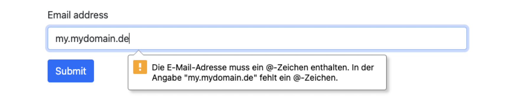
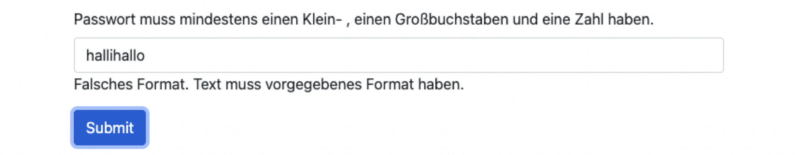

- **_Datenvalidierung_** prüft Daten auf Einhaltung bestimmter zuvor aufgestellter Regeln, z.B. Einhaltung eines definierten Wertebereichs, einer vorgegebenen Syntax oder eines bestimmten Formats
- **_Datenverifizierung_** bezieht sich auf die Richtigkeit von Daten und prüft deren Korrektheit
- hier: Validierung von Benutzereingaben eines Formulars


# 1 Arten der Validierung

- _Clienseitige Validierung_: liefert schnelles Feedback an den Nutzer und entlastet den Server
- _Serverseitige Validierung_: Sicherstellung der Validität auch bei fremder Clientsoftware und Nutzung durch APIs
- _Beidseitige Validierung_: kombiniert die Vorteile client- und serverseitiger Validierung und ist hier bevorzugt

**Clientbasierte Validierungstechniken**
- Browserbasiert
- JavaScript Validation API für das DOM
- JavaScript Reguläre Ausdrücke (Regular Expressions)


# 2 Reguläre Ausdrücke

- **_Reguläre Ausdrücke_** (**_Regular Expressions_**): Beschreibung regulärer Sprachen, welche sich in der Chomsky Hierarchie auf der untersten Ebene befinden und damit die ausdrucksschwächsten Sprache darstellen
- Erzeugung durch reguläre Grammatiken
- Hier: Definition von Syntaxregeln zur Validierung von Nutzereingaben 
- Reguläre Ausdrücke können in Javascript auf zwei Arten erstellt werden
- Mit der Methode `**test**` können Zeichenketten auf die Gültigkeit des regulären Ausdrucks überprüft werden


---


```
[a-z0-9._%+-]+@[a-z0-9.-]+\.[a-z]{2,}$

(?=.*\d)(?=.*[a-z])(?=.*[A-Z]).{8,}

`**^(http(s):\/\/.)[-a-zA-Z0-9@:%._\+~#=]{2,256}\.[a-z]{2,6}\b([-a-zA-Z0-9@:%_\+.~#?&//=]*)$**`
```


---


```

(0?[1-9]|[12][0-9]|3[01])[\/\-](0?[1-9]|1[012])[\/\-]\d{4}

(?:(?:31(\/|-|\.)(?:0?[13578]|1[02]))\1|(?:(?:29|30)(\/|-|\.)(?:0?[13-9]|1[0-2])\2))(?:(?:1[6-9]|[2-9]\d)?\d{2})$|^(?:29(\/|-|\.)0?2\3(?:(?:(?:1[6-9]|[2-9]\d)?(?:0[48]|[2468][048]|[13579][26])|(?:(?:16|[2468][048]|[3579][26])00))))$|^(?:0?[1-9]|1\d|2[0-8])(\/|-|\.)(?:(?:0?[1-9])|(?:1[0-2]))\4(?:(?:1[6-9]|[2-9]\d)?\d{2})

```

# 3 BROWSERBASIERTE VALIDIERUNG


```html
<form class="container">
  <br><br>
  <div class="mb-3">
    <label for="emailInput" class="form-label">Email address</label>
    <input type="email" class="form-control" id="emailInput">
  </div>
  <button type="submit" class="btn btn-primary">Submit</button>
</form>
```



- Moderne Browser führen eine automatische Validierung von Formulareingaben aus
- Validierungsregeln basieren auf dem `**type**`-Attribut des `**input**`-Elements (`**email**`, `**date**`, `**url**`, `**tel**`, `**number**`, `**password**`, ... ) und anderen Attributen, z.B. `**required**`, `**min**`, `**max**`
- Nachteile: Validierung ist in verschiedenen Browsern nicht einheitlich implementiert und Validierungsfeedback passt sich nicht an das Design der Webseite an


---
pattern 的使用 

- Regeln für die automatische Validierung durch den Browser können durch das `**pattern**`-Attribut angepasst werden
- `**pattern**` erlaubt die Hinterlegung eines regulären Ausdrucks (ohne die Anfangs- und Endbegrenzungen `**/**` und `**/**`), der bei der Validierung zum Einsatz kommt

```html
<form class="container">
  <br><br>
  <div class="mb-3">
    <label for="emailInput" class="form-label">Passwort muss mindestens
        einen Klein- , einen Großbuchstaben und eine Zahl haben.</label>
    <input type="text" pattern="(?=.*\d)(?=.*[a-z])(?=.*[A-Z]).{8,}" 
           class="form-control" id="emailInput">
  </div>
  <button type="submit" class="btn btn-primary">Submit</button>
</form>
```

# 4 JAVASCRIPT VALIDATION API

- Browserbasierte Validierung kann durch `**novalidate**` im `**form**`-Element unterbunden werden
- Autor der Webseite muss dann eine eigene JavaScript-Funktion für die Validierung schreiben
- Beispiel zeigt die Anwendung der Methode `**checkValidity()**` auf dem DOM-Element des Eingabefeldes, welche die Eingabe basierend auf dem im `**pattern**`-Attribut hinterlegten regulären Ausdruck prüft
- `**validate()**` wird bei Klick auf den Submit-Button aufgerufen und schreibt Validierungsfeedback in ein hinterlegtes `**div**`-Element

- Anstelle des `**pattern**`-Attributs kann der reguläre Ausdruck auch in JavaScript definiert werden
- Validierung erfolgt dann durch Übergabe der Zeichenkette an `**test**`-Methode des regulären Ausdrucks

```html
<form class="container" novalidate autocomplete="off"> 
  <br><br>
  <div class="mb-3">
    <label for="emailInput" class="form-label">Passwort muss mindestens
        einen Klein- , einen Großbuchstaben und eine Zahl haben.</label>
    <input type="text" pattern="(?=.*\d)(?=.*[a-z])(?=.*[A-Z]).{8,}" 
           class="form-control" id="emailInput">
    <div id="validation-feedback">
    <!-- Hier wird der Feedback-Text reingeschrieben -->
    </div>
  </div>
  <button type="button" onclick="validate()" class="btn btn-primary">Submit</button>
</form>

<script>
  function validate() {
    const inputElement=document.getElementById("emailInput");
    if (!inputElement.checkValidity()) {
      document.getElementById("validation-feedback").innerHTML=
      "Falsches Format. Text muss vorgegebenes Format haben.";
    }
    return false;
  }
</script>
```




# 5 Validierungsergebnisse in Bootstrap

```html
<form class="container" novalidate>
  <br><br>
  <div class="mb-3">
    <label for="emailInput" class="form-label">Email address</label>
    <input type="email" class="form-control is-valid" id="emailInput">
    <div class="invalid-feedback">
      Die Emailadresse muss ein @-Zeichen enthalten.
    </div>
  </div>
  <button type="submit" class="btn btn-primary">Submit</button>
</form>
```


- In Bootstrap kann das Ergebnis der Validierung durch die Klassen `**.is-valid**` (grüne Umrandung) und `**.is-invalid**` (rote Umrandung) auf dem Eingabefeld gegeben werden
- Zusätzlicher Feedbacktext kann durch ein `**div**` der Klasse `**.invalid-feedback**` und `**.valid-feedback**` eingeblendet werden
- Validierungslogik muss selber programmiert werden, Bootstrap validiert nicht


