https://topaz-naranja-ef8.notion.site/10-1-L-sung-Schritt-f-r-Schritt-1797794f0a67804d9c75edc7e15ef169

Vue.js-Anwendung, mit der vom letzten Tutorium bekannten Bob’s Getränke GmbH. Durch die Aufteilung auf mehrere Komponenten ist jedoch die Funktionalität der Anwendung in manchen Teilen kaputt gegangen. In dieser Aufgabe soll nun die Funktionalität wiederhergestellt sowie weitere Features implementiert werden.

1. Machen Sie sich vertraut mit der Aufteilung der Komponenten.
2. Fügen Sie die Komponente filterInputs in der App Komponente hinzu, um sie sichtbar zu machen.
3. Füge nun die Komponente stockList in der App Komponente hinzu. Damit diese korrekt angezeigt werden kann, benötigt sie den stock. Dieser wurde in einer JSONDatei im assets-Ordner ausgelagert. Importiere diese Datei in App und gebe sie der stockList Komponente als Property mit.
4. Die Filter Optionen funktionieren nicht mehr. Die Funktionalität befindet sich in der App Komponente, die Eingaben jedoch in der filterInputs Komponente. Die filterInputs Komponente muss daher die notwendigen Informationen an die App Komponente senden. Füge dazu Event-Listener den input-Feldern in filterInputs hinzu, die den aktuellen Wert des inputs als Ereignis zur App senden, wo diese abgefangen werden.
5. Als nächstes ist die Sortierung dran. Auch diese Funktionalität liegt in App, die Eingaben jedoch in stockList. Die stockList Komponente muss damit die Informationen an die App Komponente schicken.
6. Da nun alle Funktionalität wieder vorhanden ist, wünscht sich der Geschäftsführer Bob noch weitere Features. Beim Klicken auf ein Getränk sollen weitere Informationen zu diesem in einem Modal angezeigt werden. Jedes Getränk im stock hat dazu die Eigenschaft information (siehe stock.json). Erstelle dazu eine neue Komponente, die einen Bootstrap-Modal beinhaltet. Die Informationen, die angezeigt werden sollen, müssen der neuen Komponente mitgegeben werden. Der Titel des Modal soll der brand Name sein und im body soll der Text aus information angezeigt werden.
7. Um für mehr Barrierefreiheit im Modal zu sorgen, soll der Text in drei unterschiedlichen Schriftgrößen angezeigt werden können. Dazu soll mit Klick auf plus bzw. minus Knöpfe im Header die font-size auf large bzw. small gesetzt werden. Die voreingestellte Schriftgröße medium liegt in der Mitte der beiden. Die eingestellte Schriftgröße soll dabei beibehalten werden, auch wenn das Modal geschlossen wird und ein anders Getränke-Modal geöffnet wird.
8. Bob möchte auch eine Möglichkeit haben eine neues Getränk in seinen Bestand einzutragen, hierfür wurde extra der Button add new drink in App hinzugefügt. Ihnen ist auch schon die Datei die das dafür vorgesehen modal implementiert gegeben (addDrink.vue). Vervollständigen Sie den Code, so dass sie auch tatsächlich neue Getränke in den Bestand aufnehmen können.


# 1 Drinkinformation.vue 


# 2 步骤图

## 2.1 Fügen Sie die Komponente filterInputs ein
Fügen Sie die Komponente filterInputs in der App Komponente hinzu, um sie sichtbar zu machen.

App.vue
```js
import 'bootstrap/dist/css/bootstrap.min.css';
import 'bootstrap';
import { ref, computed } from 'vue';

import filterInputs from './components/filterInputs.vue';
```

```html
<div class="row">
	<!-- Aufgabe 9.1.2 -->
  <filterInputs />
</div>
```

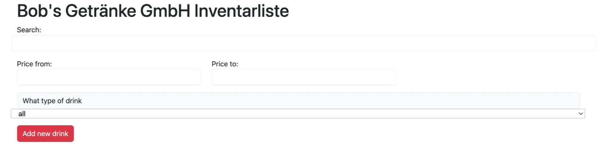


## 2.2 Füge nun die Komponente stockList ein 

Füge nun die Komponente stockList in der App Komponente hinzu. Damit diese korrekt angezeigt werden kann, benötigt sie den stock. Dieser wurde in einer JSON-Datei im assets-Ordner ausgelagert. Importiere diese Datei in App und gebe sie der stockList Komponente als Property mit.


App.vue
```js
import 'bootstrap/dist/css/bootstrap.min.css';
import 'bootstrap';
import { ref, reactive, computed } from 'vue';

import filterInputs from './components/filterInputs.vue';
import stockList from './components/stockList.vue';
import stockData from './assets/stock.json'

const stock = reactive(stockData);

```

```html
<div class="row">
	<!-- Aufgabe 9.1.3 -->
  <stockList 
	  :stock="filteredStock"/>
</div>
```

stockList.vue
```js
import 'bootstrap/dist/css/bootstrap.min.css';
import 'bootstrap';

defineProps(['stock'])
```

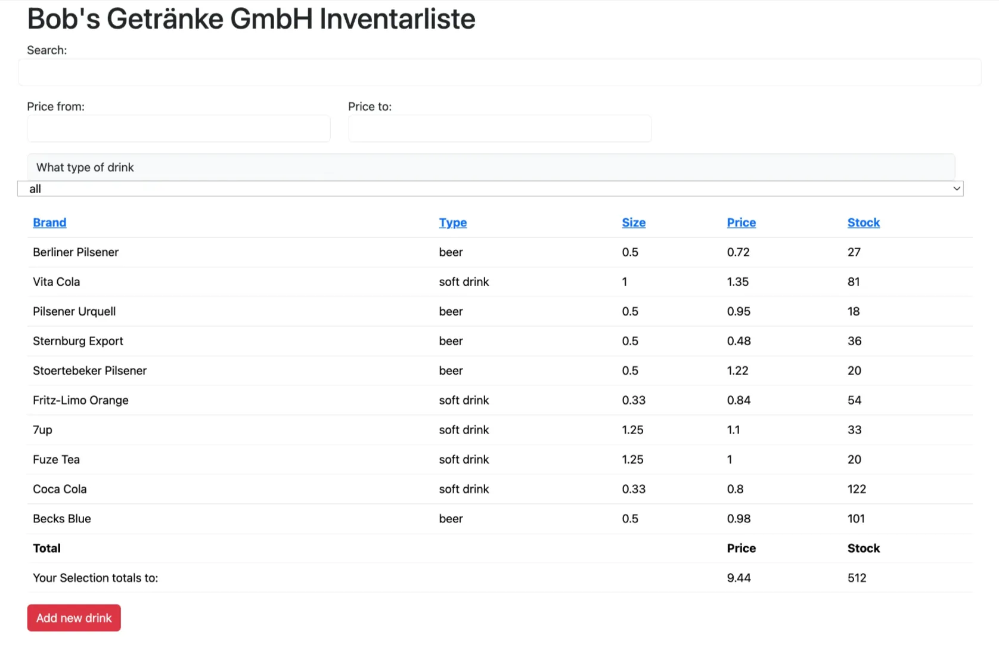

## 2.3 Filteroptionen Funktion aktivieren 

Die Filteroptionen funktionieren nicht mehr. Die Funktionalität befindet sich in der App Komponente, die Eingaben jedoch in der filterInputs Komponente. Die filterInputs Komponente muss daher die notwendigen Informationen an die App Komponente senden. Füge dazu Event-Listener den input-Feldern in filterInputs hinzu, die den aktuellen Wert des inputs als Ereignis zur App senden, wo diese abgefangen werden.


filterInputs.vue
```js
import 'bootstrap/dist/css/bootstrap.min.css';
import 'bootstrap';
import { ref } from 'vue';

const filterkey = ref('');
const priceFrom = ref(0);
const priceTo = ref(0);
const typeFilter = ref('all')
```


```html
<template>
	<div class="container">
	  <div class="row">
	    <div>Search:</div>
	      <!-- "Search" input -->
        <!-- Aufgabe 9.1.4 -->
        <input type="text" class="form-control mb-3" @input="$emit('filterkeyEvent', filterkey)" v-model="filterkey">
      </div>
      <div class="row">
	      <div class="col-4">
	        Price from:
          <!-- "Price from" input -->
          <!-- Aufgabe 9.1.4 -->
          <input type="number" class="form-control" min="0" @input="$emit('priceFromEvent', priceFrom)" v-model="priceFrom">
        </div>
        <div class="col-4">
			    Price to: 
          <!-- "Price to" input -->
          <!-- Aufgabe 9.1.4 -->
          <input type="number" class="form-control" min="0" @input="$emit('priceToEvent', priceTo)" v-model="priceTo">
        </div>
      </div>
      <div class="row input-group mt-3 mb-3 col-6">
	      <div class="input-group-prepend">
	        <label class="input-group-text" for="inputGroupSelect">What type of drink</label>
        </div>
        <!-- Type select -->
        <!-- Aufgabe 9.1.4 -->
				<select class="custom-select" id="inputGroupSelect" v-model="typeFilter">
					<option value="all" selected>all</option>
					<option value="soft drink">soft drink</option>
					<option value="beer">beer</option>
				</select>
      </div>
    </div>
</template>
```


App.vue
```js
import 'bootstrap/dist/css/bootstrap.min.css';
import 'bootstrap';
import { ref, watch } from 'vue';

const filterkey = ref('');
const priceFrom = ref(0);
const priceTo = ref(0);
const typeFilter = ref('all')

const emit = defineEmits(['filterkey', 'priceFrom', 'priceTo', 'typeFilter'])
watch(typeFilter, value => emit('typeFilter', value))
```


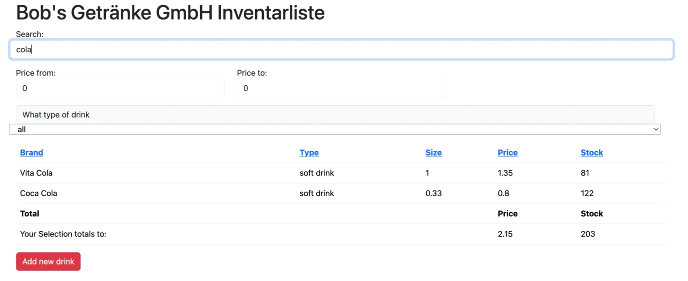

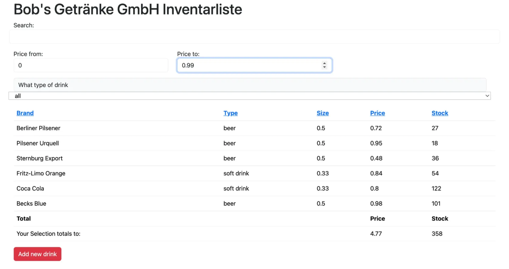

## 2.4 Sortierung Funktion 

Als nächstes ist die Sortierung dran. Auch diese Funktionalität liegt in App, die Eingaben jedoch in stockList. Die stockList Komponente muss damit die Informationen an die App Komponente schicken.


stockList.vue
```js
import 'bootstrap/dist/css/bootstrap.min.css';
import 'bootstrap';

defineProps([
	'stock'
])

const emit = defineEmits(['brand', 'type', 'size', 'price', 'stock'])
```


```html
<thead>
	<tr>
		<!-- Aufgabe 9.1.5 -->
		<th><a href="#" @click="$emit('clickEvent', 'brand')">Brand</a></th>
		<th><a href="#" @click="$emit('clickEvent', 'type')">Type</a></th>
		<th><a href="#" @click="$emit('clickEvent', 'size')">Size</a></th>
		<th><a href="#" @click="$emit('clickEvent', 'price')">Price</a></th>
		<th><a href="#" @click="$emit('clickEvent', 'stock')">Stock</a></th>
	</tr>
</thead>
```


App.vue
```js
<div class="row">
	<!-- Aufgabe 9.1.3 -->
  <stockList 
	  :stock="filteredStock"
    @clickEvent="changeSortParam($event)"
  />
</div>
```


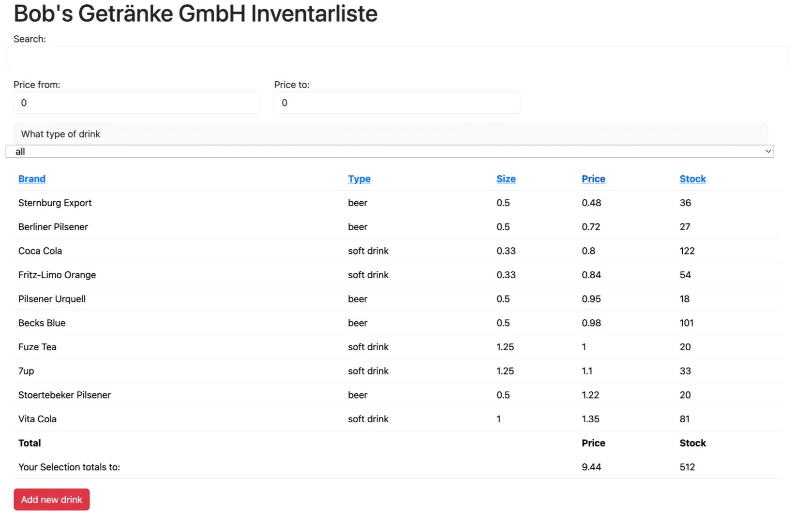

“Price” geklickt
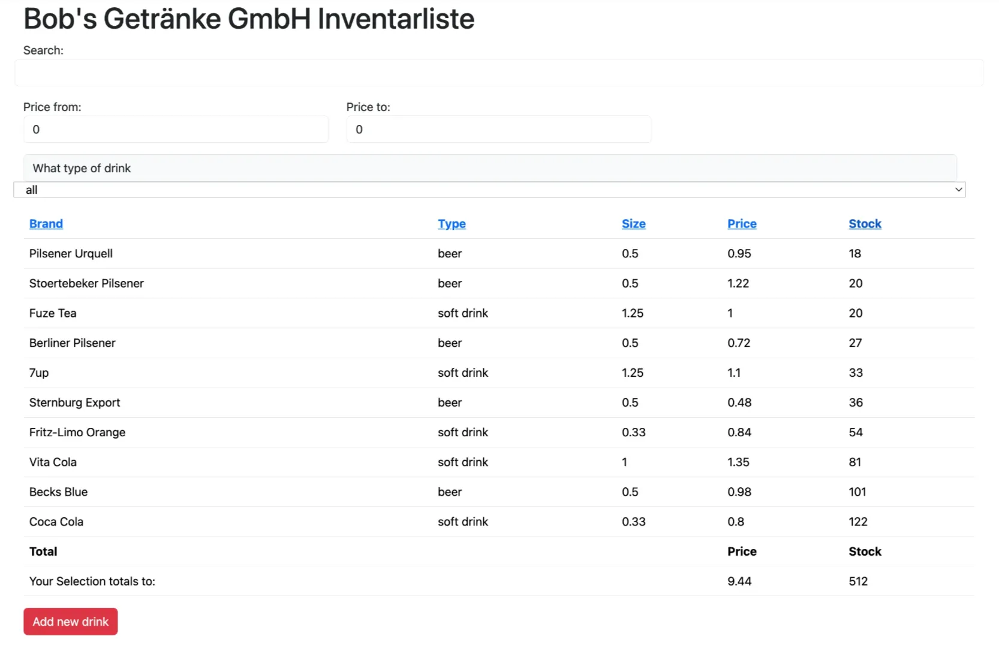

## 2.5 DrinksInformation Windows  

5
Da nun alle Funktionalität wieder vorhanden ist, wünscht sich der Geschäftsführer Bob noch weitere Features. Beim Klicken auf ein Getränk sollen weitere Informationen zu diesem in einem Modal angezeigt werden. Jedes Getränk im stock hat dazu die Eigenschaft information (siehe stock.json). Erstelle dazu eine neue Komponente, die einen Bootstrap-Modal beinhaltet. Die Informationen, die angezeigt werden sollen, müssen der neuen Komponente mitgegeben werden. Der Titel des Modal soll der brand Name sein und im body soll der Text aus information angezeigt werden.


6
Um für mehr Barrierefreiheit im Modal zu sorgen, soll der Text in drei unterschiedlichen Schriftgrößen angezeigt werden können. Dazu soll mit Klick auf plus bzw. minus Knöpfe im Header die font-size auf large bzw. small gesetzt werden. Die voreingestellte Schriftgröße medium liegt in der Mitte der beiden. Die eingestellte Schriftgröße soll dabei beibehalten werden, auch wenn das Modal geschlossen wird und ein anders Getränke-Modal geöffnet wird.


DrinkInformation.vue

```vue
<script setup>
import 'bootstrap/dist/css/bootstrap.min.css';
import 'bootstrap';
import { ref } from 'vue';

defineProps([
    'drinkprop'
])

const isLargeFont = ref(false);

const toggleFontSize = () => {
    isLargeFont.value = !isLargeFont.value;
};
</script>

<template>
	<div>
	  <!-- Modal -->
    <div class="modal fade" id="drinkInformation" tabindex="-1" role="dialog" aria-labelledby="exampleModalLongTitle" aria-hidden="true">
	    <div class="modal-dialog" role="document">
	      <div class="modal-content">
	        <div class="modal-header d-flex justify-content-between align-items-center">
	          <h5 class="modal-title" id="exampleModalLongTitle">{{ drinkprop.brand }}</h5>
            <div>
		          <button 
		            type="button" 
	              class="btn btn-warning btn-sm" 
	              @click="toggleFontSize">
	              {{ isLargeFont ? 'Normale Schriftgröße' : 'Große Schriftgröße' }}
	            </button>
	          </div>
            <button type="button" class="close" data-bs-dismiss="modal" aria-label="Close">
	            <span aria-hidden="true">&times;</span>
            </button>
          </div>
          <div class="modal-body" :class="{ 'large': isLargeFont }">
		        {{ drinkprop.information }}
          </div>
          <div class="modal-footer">
	          <button type="button" class="btn btn-secondary" data-bs-dismiss="modal">Schließen</button>
          </div>
        </div>
      </div>
    </div>
	</div>
</template>

<style scoped>
    .large { 
        font-size: 30px;
    }
</style>
```


stockList.vue
```js
import 'bootstrap/dist/css/bootstrap.min.css';
import 'bootstrap';
import { reactive } from 'vue';

import DrinkInformation from "/src/components/drinkInformation.vue"

defineProps([
    'stock'
])

const emit = defineEmits(['brand', 'type', 'size', 'price', 'stock'])
const selectedDrink = reactive({ brand:'none', type:'none', size:0, price:0, stock:0, information:'none' })

function getInformation(drink) {
    Object.assign(selectedDrink, drink)
}
```


Ich habe gerade festgestellt, dass ich da alles richtig gemacht habe. Es gab weder einen Tippfehler noch etwas Ähnliches. Die Seite war ganz weiß, weil der nächste (untere) Schritt gefehlt hat. Die DrinkInformation-Komponente braucht sofort ihre Props, da schon in dem Code, den ihr von mir bekommen habt, bereits defineProps(`[…]`) definiert steht. Fügt einfach <DrinkInformation :drinkprop="selectedDrink"/> in stockList.vue ein, und alles wird funktionieren. Sorry für die Verwirrung! Ich wusste selbst nicht, dass das Ganze so funktioniert (oder eben nicht funktioniert xD).
```html
	 	<table>
			...
		  <tr v-else>
			  <td>Nothing selected</td>
			  </tr>
			</tbody>
		</table>
		<DrinkInformation :drinkprop="selectedDrink"/>
	</div>
</template>
```

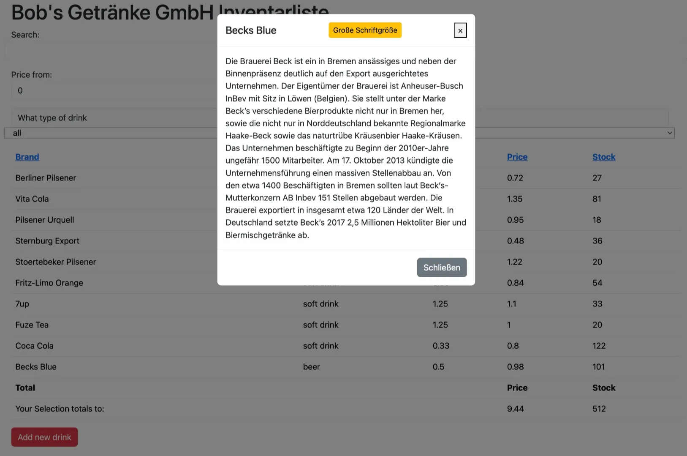

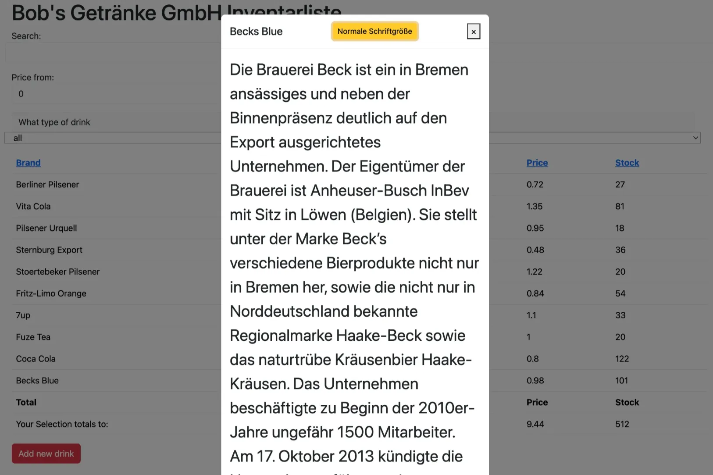


## 2.6 addedDrink windows 

Bob möchte auch eine Möglichkeit haben eine neues Getränk in seinen Bestand einzutragen, hierfür wurde extra der Button add new drink in App hinzugefügt. Ihnen ist auch schon die Datei die das dafür vorgesehen modal implementiert gegeben (addDrink.vue). Vervollständigen Sie den Code, so dass sie auch tatsächlich neue Getränke in den Bestand aufnehmen können.


addDrink.vue
```js
import 'bootstrap/dist/css/bootstrap.min.css';
import 'bootstrap';
import { reactive } from 'vue'

defineEmits(['addedDrink']);

const addObject = reactive({ brand:'', type:'beer', size:0, price:0, stock:0, information:'' })
```


```html
<div class="modal-body">
	Name of drink:
	<input type="text" class="form-control mb-3" v-model="addObject.brand">
	Description:
	<textarea class="form-control mb-3" v-model="addObject.information"></textarea>
	Size:
	<input type="number" class="form-control mb-3" v-model="addObject.size">
	Price:
	<input type="number" class="form-control mb-3" v-model="addObject.price">
	Amount:
	<input type="number" class="form-control mb-3" v-model="addObject.stock">
	Which kind:
	<div class="btn-group" role="group" aria-label="Basic radio toggle button group">
		<input type="radio" class="btn-check" name="btnradio" id="btnradio1" autocomplete="off" checked value="beer" v-model="addObject.type">
    <label class="btn btn-outline-primary" for="btnradio1">beer</label>
		<input type="radio" class="btn-check" name="btnradio" id="btnradio2" autocomplete="off" value="soft drink" v-model="addObject.type">
    <label class="btn btn-outline-primary" for="btnradio2">soft drink</label>
  </div>
</div>
```


```html
<div class="modal-footer">
	<button class="btn btn-success" data-bs-dismiss="modal" 
	@click="$emit('addedDrink', {...addObject})">
	Add
	</button>
	<button type="button" class="btn btn-secondary" data-bs-dismiss="modal">
	Cancel
	</button>
</div>
```


App.vue

```js
import 'bootstrap/dist/css/bootstrap.min.css';
import 'bootstrap';
import { ref, reactive, computed } from 'vue';

import filterInputs from './components/filterInputs.vue';
import stockList from './components/stockList.vue';
import stockData from './assets/stock.json'
import addDrink from './components/addDrink.vue';
```

```html
<!-- addDrinkModal is eine id von html element in addDrink.vue. data-bs-toggle="modal"  modal ist 点击button, 会弹出一个窗口, 就是 modal 互動視窗 形式 -->
<button class="btn btn-danger" data-bs-toggle="modal" data-bs-target="#addDrinkModal">Add new drink</button>
<addDrink @addedDrink="addToStock($event)"/>
```


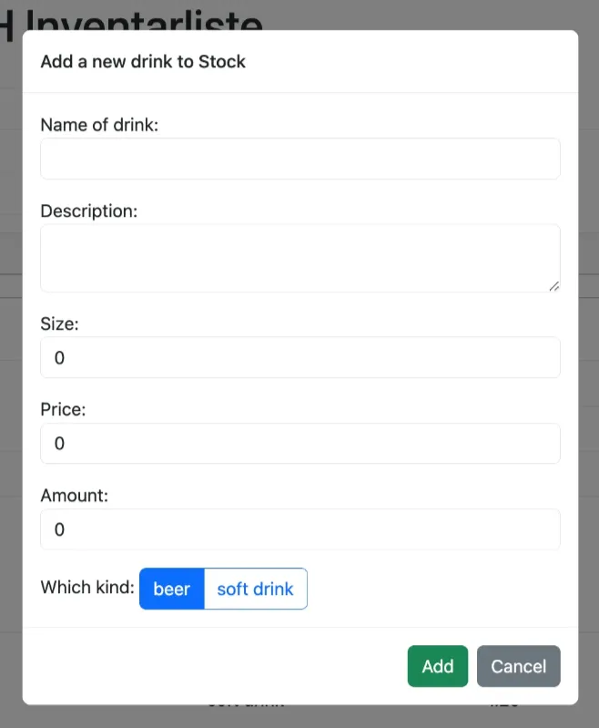

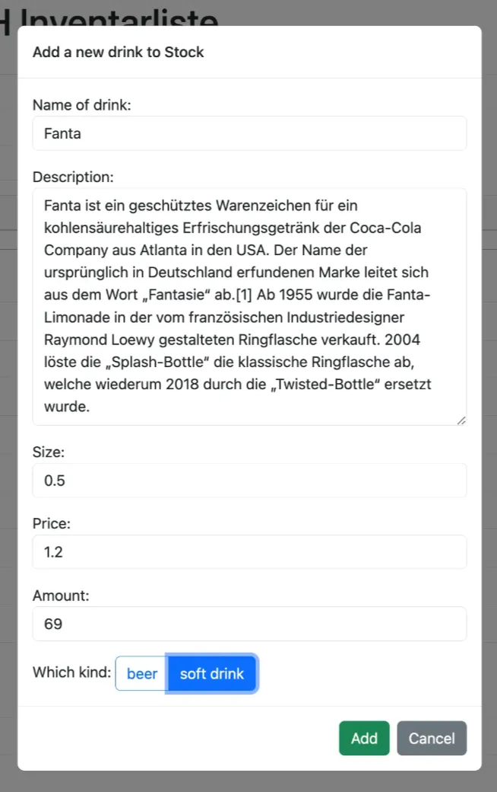


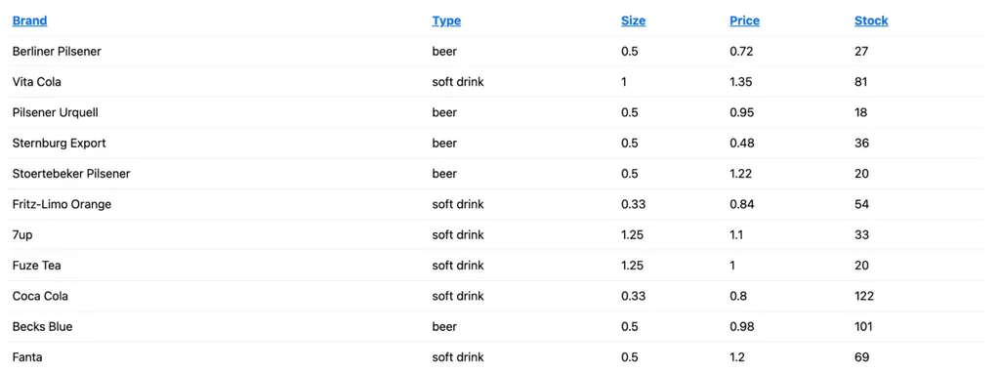


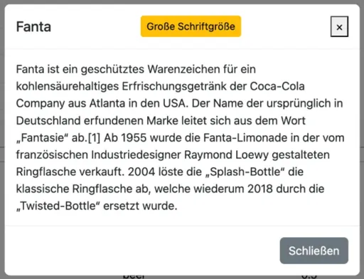

